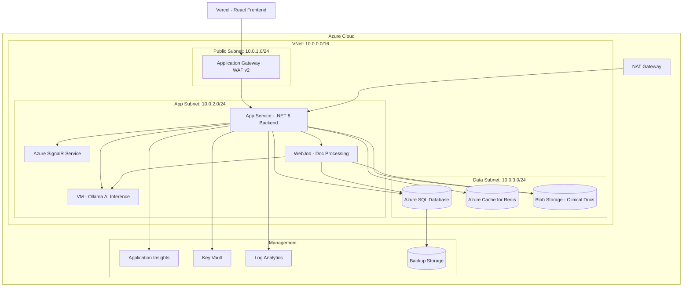
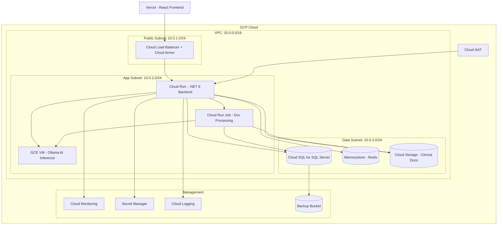

# Infrastructure Specification

## Project Overview

Infrastructure plan for the Unified Patient Access & Clinical Intelligence Platform — a HIPAA-compliant healthcare application combining patient scheduling with AI-powered clinical data intelligence. The platform uses a modular monolith backend (ASP.NET Core 8), React frontend, SQL Server database, Upstash Redis caching, and local AI inference (Ollama + Phi-3-mini). Phase 1 targets free-tier infrastructure; this spec defines the production-grade cloud topology for both Azure and GCP to support future scaling.

## Target Configuration

| Attribute | Value |
|-----------|-------|
| Cloud Providers | Both (Azure + GCP) |
| IaC Tool | Terraform |
| Environments | dev, qa, staging, prod |

## Environment Matrix

| Environment | Purpose | Availability | Scale | Approval Required |
|-------------|---------|--------------|-------|-------------------|
| dev | Development & testing | Single AZ | Minimal (free-tier aligned) | None |
| qa | Quality assurance | Single AZ | Reduced | None |
| staging | Pre-production validation | Multi-AZ | Production-like | 1 approver |
| prod | Production workloads | Multi-AZ | Full scale (500 concurrent) | 2 approvers |

---

## Infrastructure Requirements

### Compute Requirements

- INFRA-001: System MUST provision an ASP.NET Core 8.0 backend service on Azure App Service (B1 tier for dev/qa, S1 for staging, S2 for prod) or GCP Cloud Run (1 vCPU/512 MB for dev/qa, 2 vCPU/2 GB for staging/prod) with .NET 8 runtime. Traced from: TR-002, NFR-001, NFR-015.
- INFRA-002: System MUST configure auto-scaling for the backend with minimum 1 instance and maximum 5 instances in prod, scaling on CPU > 70% or memory > 80%. Traced from: NFR-015 (500 concurrent users).
- INFRA-003: System MUST provision a dedicated compute instance for Ollama AI inference with minimum 4 vCPU, 8 GB RAM (CPU-only) for local LLM hosting of Phi-3-mini (3.8B parameters). Traced from: TR-007, AIR-S01, C-5.
- INFRA-004: System MUST provision a background worker process (Azure WebJob / Cloud Run Job) for clinical document extraction pipeline with maximum 2 concurrent jobs. Traced from: AD-005, AIR-O04.
- INFRA-005: System MUST deploy the React frontend via Vercel free tier (external to cloud provider) with CDN and automatic HTTPS. Traced from: TR-001, C-1.
- INFRA-006: System MUST provision SignalR Service (Azure) or a WebSocket-capable endpoint (GCP Cloud Run) for real-time slot availability updates to connected clients. Traced from: TR-005, NFR-002 (500 ms latency).

### Networking Requirements

- INFRA-010: System MUST provision a VNet (Azure) with CIDR 10.0.0.0/16 or VPC (GCP) with CIDR 10.0.0.0/16, with separate subnets for public, application, and data tiers. Traced from: NFR-010, SEC standards.
- INFRA-011: System MUST isolate the database and cache in a private subnet with no direct public internet access; application tier in a separate private subnet. Traced from: cloud-architecture-standards (private subnets for data).
- INFRA-012: System MUST provision an Application Gateway (Azure) / Cloud Load Balancer (GCP) with WAF capability for routing external HTTPS traffic to the backend service. Traced from: NFR-010 (OWASP), cloud-architecture-standards.
- INFRA-013: System MUST configure NSG (Azure) / Firewall rules (GCP) with deny-by-default inbound policy; allow only HTTPS (443) on the public subnet and application-to-data traffic on internal ports (1433 for SQL, 6379 for Redis). Traced from: NFR-010, security-standards-owasp.
- INFRA-014: System MUST configure private endpoints for Azure SQL / Cloud SQL to prevent database traffic from traversing the public internet. Traced from: cloud-architecture-standards (private endpoints for PaaS).
- INFRA-015: System MUST provision a NAT Gateway for outbound internet access from private subnets (required for SendGrid, Twilio, Google Calendar API, Microsoft Graph API calls). Traced from: TR-015, TR-016.

### Storage Requirements

- INFRA-020: System MUST provision Azure Blob Storage (Hot tier) / GCP Cloud Storage (Standard) for encrypted clinical document storage with AES-256 server-side encryption. Initial capacity: 50 GB, growing 10 GB/month based on 10,000 clinical documents/month (NFR-016). Traced from: DR-004, NFR-005.
- INFRA-021: System MUST configure geo-redundant storage (GRS) for prod and locally-redundant storage (LRS) for dev/qa/staging to balance cost and availability. Traced from: NFR-012, DR-014.
- INFRA-022: System MUST configure lifecycle management to move clinical documents older than 1 year to cool/nearline storage tier for cost optimization while maintaining the 7+ year retention requirement. Traced from: DR-012.
- INFRA-023: System MUST provision a separate encrypted storage container/bucket for database backups with write-only access (no delete) from the application service account. Traced from: DR-015.

### Database Requirements

- INFRA-030: System MUST provision Azure SQL Database (S0 tier for dev/qa, S2 for staging, S3 for prod) / Cloud SQL for SQL Server (db-custom-1-3840 for dev/qa, db-custom-2-7680 for staging/prod) with Transparent Data Encryption enabled. Traced from: TR-003, NFR-005, DR-001 through DR-009.
- INFRA-031: System MUST configure database HA with zone-redundant deployment in prod (Azure SQL Zone Redundant / Cloud SQL HA) achieving RTO of 4 hours and RPO of 24 hours. Traced from: DR-014, NFR-012.
- INFRA-032: System MUST configure automated daily backups with 35-day retention for prod and 7-day retention for non-prod environments. Traced from: DR-014.
- INFRA-033: System MUST configure database firewall to allow connections only from the application subnet IP range and deny all public access. Traced from: INFRA-014, NFR-010.
- INFRA-034: System MUST provision Upstash Redis (free tier for dev/qa, Pro tier for staging/prod) or Azure Cache for Redis (C0 for dev/qa, C1 for staging/prod) / Memorystore (Basic 1 GB for dev/qa, Standard 1 GB for prod) for distributed caching. Traced from: TR-004, NFR-017.

---

## Security Requirements (SEC-XXX)

### Network Security

- SEC-001: System MUST implement network isolation with separate VNet/VPC per environment (dev, qa, staging, prod). Traced from: cloud-architecture-standards.
- SEC-002: System MUST configure WAF (Azure WAF v2 / GCP Cloud Armor) on the Application Gateway/Load Balancer with OWASP 3.2 managed rule set enabled. Traced from: NFR-010, cloud-architecture-standards.
- SEC-003: System MUST enable DDoS Protection (Azure DDoS Protection Standard / GCP Cloud Armor DDoS) for production environment. Traced from: cloud-architecture-standards.
- SEC-004: System MUST configure private endpoints for all PaaS database and cache services to prevent data traversal over public internet. Traced from: cloud-architecture-standards, NFR-005.

### Data Security

- SEC-010: System MUST encrypt all data at rest using AES-256 (Azure SQL TDE + column-level encryption for PHI fields, Cloud SQL encryption at rest). Traced from: NFR-005.
- SEC-011: System MUST enforce TLS 1.2 or higher for all data in transit including client-server, server-database, and server-external-service connections. Traced from: NFR-006.
- SEC-012: System MUST use customer-managed keys (Azure Key Vault CMK / GCP Cloud KMS) for PHI encryption in production to satisfy HIPAA Technical Safeguards. Traced from: NFR-005, HIPAA compliance.
- SEC-013: System MUST encrypt all backup storage with AES-256 using separate encryption keys from primary data. Traced from: DR-015.

### Identity & Access

- SEC-020: System MUST use Managed Identity (Azure) / Workload Identity (GCP) for all service-to-service authentication eliminating stored credentials. Traced from: terraform-iac-standards, security-standards-owasp (A02).
- SEC-021: System MUST implement RBAC with least privilege — application service accounts receive only the minimum permissions required for database, storage, cache, and Key Vault/Secret Manager access. Traced from: NFR-009, security-standards-owasp (A01).
- SEC-022: System MUST provision Azure Key Vault (Standard tier) / GCP Secret Manager for storing connection strings, API keys (SendGrid, Twilio, Calendar APIs), and encryption keys. No secrets hardcoded in IaC or application configuration. Traced from: NFR-010, terraform-iac-standards.
- SEC-023: System MUST enforce MFA for all human access to cloud management portals and CI/CD systems. Traced from: security-standards-owasp (A07).

### Compliance

- SEC-030: System MUST comply with HIPAA Technical Safeguards (encryption, access control, audit logging, integrity controls) across all environments. Traced from: NFR-005, NFR-009, NFR-011, DR-011.
- SEC-031: System MUST enable audit logging for all resource access and configuration changes (Azure Activity Log + Diagnostic Settings / GCP Cloud Audit Logs). Traced from: DR-011, NFR-011.
- SEC-032: System MUST retain audit logs for 7 years in compliance with HIPAA record retention requirements, stored in immutable (append-only) storage. Traced from: DR-011.

---

## Operations Requirements (OPS-XXX)

### Monitoring

- OPS-001: System MUST collect application metrics (request rate, error rate, response time, CPU, memory) using Azure Application Insights (free tier) / GCP Cloud Monitoring. Traced from: NFR-012, TR-013.
- OPS-002: System MUST aggregate structured application logs using Serilog → Azure Log Analytics / GCP Cloud Logging with PHI redaction enforced at the application layer before log emission. Traced from: NFR-011, TR-012.
- OPS-003: System MUST implement health check endpoints (`/health/live`, `/health/ready`) with ASP.NET Core Health Checks monitoring SQL Server, Redis, Ollama, and SignalR dependencies. Traced from: TR-013, NFR-012.
- OPS-004: System MUST monitor AI inference service (Ollama) health and queue depth, alerting when the document processing queue exceeds 50 items or inference latency exceeds 30 seconds. Traced from: AIR-O02, AIR-O04.

### Alerting

- OPS-010: System MUST alert when API error rate exceeds 5% over a 5-minute window via Slack/Teams and email. Traced from: NFR-012.
- OPS-011: System MUST alert when p95 API response time exceeds 2 seconds. Traced from: NFR-001.
- OPS-012: System MUST alert when database CPU exceeds 80% or storage exceeds 85% capacity. Traced from: C-4 (10 GB SQL Express limit).
- OPS-013: System MUST alert when Upstash Redis daily command count exceeds 8,000 (80% of 10K free-tier limit). Traced from: C-6.
- OPS-014: System MUST alert when SendGrid daily email count exceeds 80 (80% of 100/day free-tier limit). Traced from: C-7.

### Disaster Recovery

- OPS-020: System MUST support RTO of 4 hours for production environment. Traced from: DR-014.
- OPS-021: System MUST support RPO of 24 hours for production environment via daily automated backups. Traced from: DR-014.
- OPS-022: System MUST perform automated database backups daily with encrypted backup files stored in a separate storage account/bucket from the primary database. Traced from: DR-014, DR-015.
- OPS-023: System MUST test backup restoration quarterly to validate RTO/RPO targets. Traced from: DR-014.

---

## Environment-Specific Requirements (ENV-XXX)

### Development (dev)

- ENV-001: dev MUST use minimum viable compute sizing (Azure App Service B1 / GCP Cloud Run 1 vCPU, 512 MB) to minimize cost. Traced from: C-1.
- ENV-002: dev MUST allow developer SSH/debug access to backend service for troubleshooting.
- ENV-003: dev MUST use Upstash Redis free tier (10K commands/day, 256 MB) for caching. Traced from: C-6.
- ENV-004: dev MUST use SQL Server Express or Azure SQL Basic (5 DTU) for database. Traced from: C-1.
- ENV-005: dev MUST seed dummy insurance records and synthetic patient data via EF Core migrations. Traced from: DR-017, A-5.

### QA (qa)

- ENV-010: qa MUST use anonymized/synthetic test data; no real PHI in QA environment.
- ENV-011: qa MUST support parallel test execution for integration and E2E test suites. Traced from: NFR-022.
- ENV-012: qa MUST mirror production configuration for authentication and RBAC to validate security controls.

### Staging (staging)

- ENV-020: staging MUST mirror production compute, networking, and security configuration at reduced scale.
- ENV-021: staging MUST use anonymized data replicating production data volume patterns.
- ENV-022: staging MUST require 1 approver for deployment. Traced from: cloud-architecture-standards.
- ENV-023: staging MUST deploy across minimum 2 availability zones for HA validation. Traced from: cloud-architecture-standards.

### Production (prod)

- ENV-030: prod MUST deploy across minimum 2 availability zones. Traced from: cloud-architecture-standards, NFR-012.
- ENV-031: prod MUST require 2 approvers for deployment. Traced from: cloud-architecture-standards.
- ENV-032: prod MUST restrict access to authorized operations personnel only via RBAC and MFA.
- ENV-033: prod MUST enable all monitoring, alerting, and DR configurations at full capacity.
- ENV-034: prod MUST retain audit logs for 7 years in immutable storage. Traced from: DR-011.

---

## Architecture Diagram

### Azure Architecture

### GCP Architecture

---

## Cost Estimate

### Azure

| Environment | Resource Category | Monthly Estimate | Notes |
|-------------|-------------------|------------------|-------|
| dev | Compute (App Svc B1) | $13 | 1 instance, shared |
| dev | Database (SQL Basic) | $5 | 5 DTU |
| dev | Cache (Upstash Free) | $0 | Free tier |
| dev | Storage (10 GB) | $2 | LRS Hot |
| dev | **Total** | **~$20** | |
| qa | **Total** | **~$35** | Slightly higher compute |
| staging | **Total** | **~$180** | S1 App Svc, S2 SQL, multi-AZ |
| prod | **Total** | **~$450** | S2 App Svc, S3 SQL, WAF, SignalR, AI VM |

### GCP

| Environment | Resource Category | Monthly Estimate | Notes |
|-------------|-------------------|------------------|-------|
| dev | Compute (Cloud Run min) | $0-10 | Pay per use |
| dev | Database (Cloud SQL basic) | $8 | db-f1-micro |
| dev | Cache (Upstash Free) | $0 | External free tier |
| dev | Storage (10 GB) | $1 | Standard |
| dev | **Total** | **~$20** | |
| qa | **Total** | **~$40** | |
| staging | **Total** | **~$200** | Multi-AZ, HA SQL |
| prod | **Total** | **~$500** | Full HA, Cloud Armor, AI VM |

**Cost Optimization Opportunities:**

- Use Upstash Redis free tier for dev/qa across both providers (avoids managed Redis cost)
- Auto-shutdown dev/qa environments outside business hours (50% savings)
- Reserved instances for prod database (30-40% savings on 1-year commitment)
- Spot/preemptible VM for Ollama in dev/qa (60-80% savings)
- Vercel free tier eliminates frontend hosting cost entirely

---

## Requirement Traceability

| INFRA/SEC/OPS/ENV ID | Source Description | NFR/TR/DR/AIR Reference |
|----------------------|-------------------|-------------------------|
| INFRA-001 | Backend compute provisioning | TR-002, NFR-001, NFR-015 |
| INFRA-002 | Auto-scaling configuration | NFR-015 |
| INFRA-003 | Ollama AI compute | TR-007, AIR-S01, C-5 |
| INFRA-004 | Background document processing | AD-005, AIR-O04 |
| INFRA-005 | Frontend deployment | TR-001, C-1 |
| INFRA-006 | SignalR real-time | TR-005, NFR-002 |
| INFRA-010 | VNet/VPC networking | NFR-010 |
| INFRA-011 | Private subnet isolation | Cloud Architecture Standards |
| INFRA-012 | Application Gateway + WAF | NFR-010 |
| INFRA-013 | NSG/Firewall rules | NFR-010 |
| INFRA-014 | Private endpoints for database | Cloud Architecture Standards |
| INFRA-015 | NAT Gateway for outbound | TR-015, TR-016 |
| INFRA-020 | Clinical document storage | DR-004, NFR-005 |
| INFRA-021 | Storage replication strategy | NFR-012, DR-014 |
| INFRA-022 | Storage lifecycle management | DR-012 |
| INFRA-023 | Backup storage | DR-015 |
| INFRA-030 | SQL Server database | TR-003, NFR-005 |
| INFRA-031 | Database HA and DR | DR-014, NFR-012 |
| INFRA-032 | Database backup configuration | DR-014 |
| INFRA-033 | Database firewall | NFR-010 |
| INFRA-034 | Redis cache | TR-004, NFR-017 |
| SEC-001 | Environment isolation | Cloud Architecture Standards |
| SEC-002 | WAF with OWASP rules | NFR-010 |
| SEC-003 | DDoS protection | Cloud Architecture Standards |
| SEC-010 | Encryption at rest | NFR-005 |
| SEC-011 | TLS 1.2+ in transit | NFR-006 |
| SEC-012 | Customer-managed keys | NFR-005, HIPAA |
| SEC-020 | Managed Identity | Terraform IaC Standards |
| SEC-021 | Least privilege RBAC | NFR-009 |
| SEC-022 | Secrets management | NFR-010 |
| SEC-030 | HIPAA compliance | NFR-005, NFR-009, DR-011 |
| SEC-031 | Audit logging | DR-011, NFR-011 |
| SEC-032 | 7-year log retention | DR-011 |
| OPS-001 | Application monitoring | NFR-012, TR-013 |
| OPS-002 | Log aggregation with PHI redaction | NFR-011, TR-012 |
| OPS-003 | Health check endpoints | TR-013, NFR-012 |
| OPS-010 | Error rate alerting | NFR-012 |
| OPS-011 | Latency alerting | NFR-001 |
| OPS-020 | RTO 4 hours | DR-014 |
| OPS-021 | RPO 24 hours | DR-014 |

---

## Human Review Checklist

### Resource Sizing

- [ ] Compute sizing matches NFR-001 (2s p95) and NFR-015 (500 concurrent users)
- [ ] Ollama VM sizing sufficient for Phi-3-mini inference (4 vCPU, 8 GB RAM)
- [ ] Storage sizing covers 10K clinical docs/month growth (NFR-016)
- [ ] Database sizing handles 10 GB limit awareness (C-4)

### Network Design

- [ ] Network isolation per environment (SEC-001)
- [ ] Private subnets for database and cache (INFRA-011)
- [ ] WAF enabled with OWASP rules (SEC-002)
- [ ] Private endpoints for all PaaS services (SEC-004)

### Security

- [ ] AES-256 encryption at rest (SEC-010)
- [ ] TLS 1.2+ in transit (SEC-011)
- [ ] Managed Identity for service auth (SEC-020)
- [ ] No hardcoded secrets (SEC-022)
- [ ] HIPAA Technical Safeguards addressed (SEC-030)

### Cost

- [ ] Cost estimates align with free-tier Phase 1 constraints (C-1)
- [ ] Cost optimization opportunities documented
- [ ] Reserved capacity planned for prod database

### DR/Backup

- [ ] RTO 4 hours achievable (OPS-020)
- [ ] RPO 24 hours with daily backups (OPS-021)
- [ ] Backup encryption with separate keys (SEC-013)
- [ ] 7-year audit log retention (SEC-032)

---

## Evaluation Scores

| Criteria | Score (0-100) |
|----------|---------------|
| Requirement Coverage | 92 |
| Security Depth | 95 |
| Cost Optimization | 85 |
| DR/HA Readiness | 88 |
| HIPAA Alignment | 95 |

**Evaluation Summary:** Infrastructure specification covers all NFR, TR, DR, and AIR requirements from design.md with detailed INFRA/SEC/OPS/ENV requirement mappings. Free-tier Phase 1 constraints are acknowledged with clear scaling paths. HIPAA compliance is enforced through encryption, access control, audit logging, and network isolation at every layer. Minor gap: Ollama compute sizing on free-tier may require GPU evaluation in Phase 2.

---

## Rules Applied

- `cloud-architecture-standards` — VNet/VPC design, environment matrix, HA patterns, anti-patterns
- `security-standards-owasp` — Encryption, access control, injection prevention, secrets management
- `terraform-iac-standards` — Naming, tagging, module structure, state management patterns

---

## Approval

| Role | Name | Date | Signature |
|------|------|------|-----------|
| Cloud Architect | | | |
| Security Engineer | | | |
| Infrastructure Lead | | | |
