## UML Models Overview

This document provides the complete set of UML visual models for the Unified Patient Access & Clinical Intelligence Platform. The diagrams are derived from two authoritative sources:

- **spec.md**: Use case specifications (UC-001 through UC-014), functional requirements (FR-001 through FR-032), and actor definitions
- **design.md**: Architecture decisions (AD-001 through AD-010), domain entities, technology stack, non-functional requirements (NFR-001 through NFR-023), data requirements (DR-001 through DR-017), and AI requirements (AIR-001 through AIR-R04)

The document is organized into three sections:

1. **Architectural Views** — Static structural diagrams showing system context, components, deployment topology, data flows, and the logical data model
2. **AI Architecture Diagrams** — RAG pipeline and AI-specific interaction flows (conditional on AIR-XXX requirements)
3. **Use Case Sequence Diagrams** — One dynamic behavioral diagram per UC-XXX, detailing message flows between actors and system components

## Architectural Views

### System Context Diagram

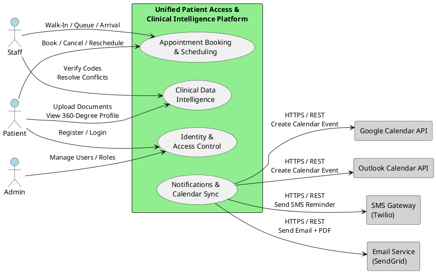
```plantuml
@startuml
!define SYSTEM rectangle
!define EXTERNAL component

skinparam componentStyle rectangle
skinparam packageStyle rectangle
left to right direction

actor "Patient" as patient #LightBlue
actor "Staff" as staff #LightBlue
actor "Admin" as admin #LightBlue

EXTERNAL "Google Calendar API" as gcal #LightGray
EXTERNAL "Outlook Calendar API" as ocal #LightGray
EXTERNAL "SMS Gateway\n(Twilio)" as sms #LightGray
EXTERNAL "Email Service\n(SendGrid)" as email #LightGray

rectangle "Unified Patient Access &\nClinical Intelligence Platform" as system #LightGreen {
  usecase "Appointment Booking\n& Scheduling" as booking
  usecase "Clinical Data\nIntelligence" as clinical
  usecase "Identity &\nAccess Control" as identity
  usecase "Notifications &\nCalendar Sync" as notify
}

patient --> booking : Book / Cancel / Reschedule
patient --> clinical : Upload Documents\nView 360-Degree Profile
patient --> identity : Register / Login
staff --> booking : Walk-In / Queue / Arrival
staff --> clinical : Verify Codes\nResolve Conflicts
admin --> identity : Manage Users / Roles

notify --> gcal : HTTPS / REST\nCreate Calendar Event
notify --> ocal : HTTPS / REST\nCreate Calendar Event
notify --> sms : HTTPS / REST\nSend SMS Reminder
notify --> email : HTTPS / REST\nSend Email + PDF

@enduml
```

### Component Architecture Diagram

```mermaid
graph TB
  subgraph "Presentation Layer"
    ReactApp[React SPA\nTypeScript 18.x]:::core
    SignalRClient[@microsoft/signalr\nClient]:::core
  end

  subgraph "API Gateway"
    WebAPI[ASP.NET Core Web API\n.NET 8.0 LTS]:::core
    AuthMW[JWT Auth Middleware]:::core
    RateLimiter[Rate Limiting\nMiddleware]:::core
    PHIMW[PHI Scrubbing\nMiddleware]:::core
  end

  subgraph "Scheduling Module"
    SchedApp[Scheduling\nApplication Layer]:::core
    SchedDomain[Scheduling\nDomain Layer]:::core
    SlotService[Slot Availability\nService]:::core
    WaitlistService[Waitlist &\nSwap Service]:::core
    QueueService[Walk-In Queue\nService]:::core
  end

  subgraph "Clinical Module"
    ClinApp[Clinical\nApplication Layer]:::core
    ClinDomain[Clinical\nDomain Layer]:::core
    OCRService[Tesseract OCR\nPipeline]:::core
    NERService[scispaCy NER\nExtraction]:::core
    RAGService[RAG Pipeline\nVector Search]:::core
    View360Service[360-Degree View\nAggregator]:::core
    CodeMapper[ICD-10 / CPT\nCode Mapper]:::core
    ConflictDetector[Data Conflict\nDetector]:::core
  end

  subgraph "Identity Module"
    IdentApp[Identity\nApplication Layer]:::core
    IdentDomain[Identity\nDomain Layer]:::core
    AuthService[ASP.NET Identity\n+ Argon2id]:::core
    RBACService[RBAC\nPolicy Engine]:::core
  end

  subgraph "Notification Module"
    NotifyApp[Notification\nApplication Layer]:::core
    NotifyDomain[Notification\nDomain Layer]:::core
    ReminderScheduler[Reminder\nBackground Service]:::core
    PDFGenerator[QuestPDF\nGenerator]:::core
    CalendarSync[Calendar Sync\nService]:::core
  end

  subgraph "AI Infrastructure"
    Ollama[Ollama + Phi-3-mini\nLocal LLM]:::external
    SemanticKernel[Semantic Kernel\nOrchestration]:::core
    MLNet[ML.NET\nNo-Show Risk Model]:::core
  end

  subgraph "Data Layer"
    SQLServer[(SQL Server Express\n2022)]:::data
    RedisCache[(Upstash Redis\nFree Tier)]:::data
    VectorStore[(SQL Server\nVector Table)]:::data
  end

  subgraph "External Services"
    SendGrid[SendGrid\nEmail API]:::external
    Twilio[Twilio\nSMS API]:::external
    GoogleCal[Google Calendar\nAPI v3]:::external
    MSGraph[Microsoft Graph\nAPI v1.0]:::external
  end

  ReactApp -->|HTTPS / REST| WebAPI
  ReactApp -->|WebSocket| SignalRClient
  SignalRClient -->|SignalR| WebAPI

  WebAPI --> AuthMW --> RateLimiter --> PHIMW

  WebAPI --> SchedApp
  WebAPI --> ClinApp
  WebAPI --> IdentApp
  WebAPI --> NotifyApp

  SchedApp --> SchedDomain
  SchedApp --> SlotService
  SchedApp --> WaitlistService
  SchedApp --> QueueService

  ClinApp --> ClinDomain
  ClinApp --> OCRService
  ClinApp --> NERService
  ClinApp --> RAGService
  ClinApp --> View360Service
  ClinApp --> CodeMapper
  ClinApp --> ConflictDetector

  IdentApp --> IdentDomain
  IdentApp --> AuthService
  IdentApp --> RBACService

  NotifyApp --> NotifyDomain
  NotifyApp --> ReminderScheduler
  NotifyApp --> PDFGenerator
  NotifyApp --> CalendarSync

  CodeMapper --> SemanticKernel
  SemanticKernel --> Ollama
  NERService --> Ollama
  RAGService --> VectorStore
  MLNet --> SQLServer

  SchedDomain --> SQLServer
  ClinDomain --> SQLServer
  IdentDomain --> SQLServer
  NotifyDomain --> SQLServer

  SlotService --> RedisCache
  View360Service --> RedisCache

  ReminderScheduler --> SendGrid
  ReminderScheduler --> Twilio
  CalendarSync --> GoogleCal
  CalendarSync --> MSGraph
  PDFGenerator --> SendGrid

  classDef core fill:#90ee90
  classDef data fill:#ffffe0
  classDef external fill:#d3d3d3
```

### Deployment Architecture Diagram

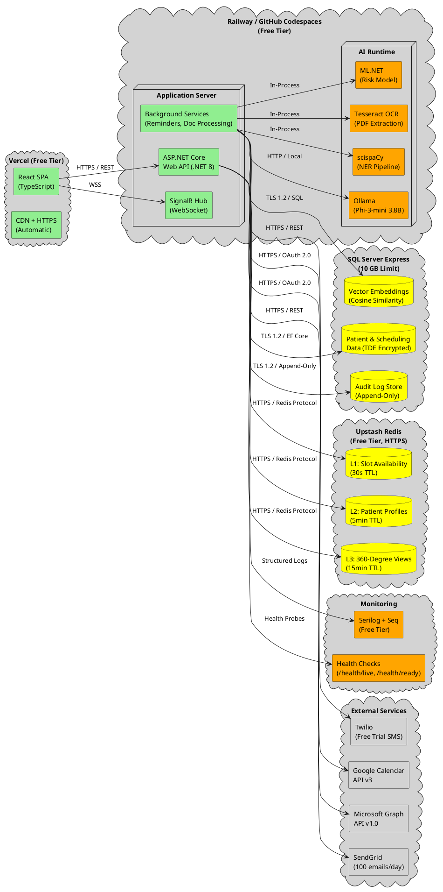
```plantuml
@startuml
!define CLOUD cloud
!define SERVER node
!define DB database

skinparam componentStyle rectangle
left to right direction

CLOUD "Vercel (Free Tier)" as vercel #LightGray {
  component "React SPA\n(TypeScript)" as frontend #LightGreen
  component "CDN + HTTPS\n(Automatic)" as cdn #LightGreen
}

CLOUD "Railway / GitHub Codespaces\n(Free Tier)" as backend_host #LightGray {
  SERVER "Application Server" as appserver {
    component "ASP.NET Core\nWeb API (.NET 8)" as api #LightGreen
    component "SignalR Hub\n(WebSocket)" as signalr #LightGreen
    component "Background Services\n(Reminders, Doc Processing)" as bgservices #LightGreen
  }

  SERVER "AI Runtime" as airuntime {
    component "Ollama\n(Phi-3-mini 3.8B)" as ollama #Orange
    component "scispaCy\n(NER Pipeline)" as scispacy #Orange
    component "Tesseract OCR\n(PDF Extraction)" as tesseract #Orange
    component "ML.NET\n(Risk Model)" as mlnet #Orange
  }
}

CLOUD "SQL Server Express\n(10 GB Limit)" as dbhost #LightGray {
  DB "Patient & Scheduling\nData (TDE Encrypted)" as maindb #Yellow
  DB "Audit Log Store\n(Append-Only)" as auditdb #Yellow
  DB "Vector Embeddings\n(Cosine Similarity)" as vectordb #Yellow
}

CLOUD "Upstash Redis\n(Free Tier, HTTPS)" as redishost #LightGray {
  DB "L1: Slot Availability\n(30s TTL)" as l1cache #Yellow
  DB "L2: Patient Profiles\n(5min TTL)" as l2cache #Yellow
  DB "L3: 360-Degree Views\n(15min TTL)" as l3cache #Yellow
}

CLOUD "External Services" as extsvc #LightGray {
  component "SendGrid\n(100 emails/day)" as sendgrid #LightGray
  component "Twilio\n(Free Trial SMS)" as twilio #LightGray
  component "Google Calendar\nAPI v3" as gcalapi #LightGray
  component "Microsoft Graph\nAPI v1.0" as msgraph #LightGray
}

CLOUD "Monitoring" as monitors #LightGray {
  component "Serilog + Seq\n(Free Tier)" as logging #Orange
  component "Health Checks\n(/health/live, /health/ready)" as healthcheck #Orange
}

frontend --> api : HTTPS / REST
frontend --> signalr : WSS
api --> maindb : TLS 1.2 / EF Core
api --> auditdb : TLS 1.2 / Append-Only
api --> l1cache : HTTPS / Redis Protocol
api --> l2cache : HTTPS / Redis Protocol
api --> l3cache : HTTPS / Redis Protocol
bgservices --> ollama : HTTP / Local
bgservices --> scispacy : In-Process
bgservices --> tesseract : In-Process
bgservices --> mlnet : In-Process
bgservices --> vectordb : TLS 1.2 / SQL
bgservices --> sendgrid : HTTPS / REST
bgservices --> twilio : HTTPS / REST
bgservices --> gcalapi : HTTPS / OAuth 2.0
bgservices --> msgraph : HTTPS / OAuth 2.0
api --> logging : Structured Logs
api --> healthcheck : Health Probes

@enduml
```

### Data Flow Diagram

```plantuml
@startuml
!define PROCESS rectangle
!define DATASTORE database
!define EXTERNAL component

skinparam componentStyle rectangle

EXTERNAL "Patient" as patient #LightBlue
EXTERNAL "Staff" as staff #LightBlue
EXTERNAL "Admin" as admin #LightBlue

PROCESS "1.0 Identity &\nAuthentication" as auth #LightGreen
PROCESS "2.0 Appointment\nBooking" as booking #LightGreen
PROCESS "3.0 Patient\nIntake" as intake #LightGreen
PROCESS "4.0 Insurance\nPre-Check" as insurance #LightGreen
PROCESS "5.0 Notification\nEngine" as notify #LightGreen
PROCESS "6.0 Document\nUpload & OCR" as docupload #LightGreen
PROCESS "7.0 Clinical Data\nExtraction (NER)" as extraction #LightGreen
PROCESS "8.0 360-Degree View\nAggregation" as view360 #LightGreen
PROCESS "9.0 Medical Code\nMapping" as coding #LightGreen
PROCESS "10.0 Conflict\nDetection" as conflict #LightGreen
PROCESS "11.0 No-Show Risk\nAssessment" as riskmodel #LightGreen
PROCESS "12.0 Audit\nLogging" as auditlog #LightGreen

DATASTORE "User Store" as userdb #Yellow
DATASTORE "Appointment Store" as apptdb #Yellow
DATASTORE "Intake Store" as intakedb #Yellow
DATASTORE "Insurance Records" as insdb #Yellow
DATASTORE "Clinical Document Store\n(Encrypted)" as docstore #Yellow
DATASTORE "Extracted Data Store" as extractdb #Yellow
DATASTORE "360-Degree View Store" as viewdb #Yellow
DATASTORE "Medical Code Store" as codedb #Yellow
DATASTORE "Audit Log Store\n(Append-Only)" as auditdb #Yellow
DATASTORE "Vector Embedding Store" as vectordb #Yellow
DATASTORE "Redis Cache" as cache #Yellow

EXTERNAL "SMS Gateway" as smsext #LightGray
EXTERNAL "Email Service" as emailext #LightGray
EXTERNAL "Calendar APIs" as calext #LightGray
EXTERNAL "Ollama LLM" as llm #LightGray

patient -> auth : Credentials
admin -> auth : User Management
auth -> userdb : Store / Query Users
auth -> auditlog : Auth Events

patient -> booking : Search / Book / Cancel
staff -> booking : Walk-In / Queue
booking -> apptdb : CRUD Appointments
booking -> cache : Slot Availability
booking -> auditlog : Booking Events

patient -> intake : Medical History / Symptoms
intake -> llm : Conversational Parsing
intake -> intakedb : Structured Intake Data

patient -> insurance : Insurance Name + ID
insurance -> insdb : Lookup Validation

booking -> notify : Appointment Events
notify -> smsext : SMS Reminders
notify -> emailext : Email + PDF
notify -> calext : Calendar Events

patient -> docupload : PDF Documents
docupload -> docstore : Encrypted Storage
docupload -> extraction : Queued Text

extraction -> llm : NER Processing
extraction -> extractdb : Confidence-Scored Data
extraction -> vectordb : Document Embeddings

extractdb -> view360 : Multi-Document Aggregation
view360 -> viewdb : Consolidated Profile
view360 -> cache : Cached View

extractdb -> conflict : Cross-Document Comparison
conflict -> staff : Flagged Conflicts

viewdb -> coding : Diagnoses + Procedures
coding -> llm : ICD-10 / CPT Classification
coding -> codedb : Suggested Codes
codedb -> staff : Verification Queue

apptdb -> riskmodel : Patient History
riskmodel -> apptdb : Risk Scores
riskmodel -> notify : High-Risk Escalation

auth -> auditlog : All PHI Access
booking -> auditlog : All Modifications
extraction -> auditlog : AI Invocations
coding -> auditlog : Code Suggestions
auditlog -> auditdb : Immutable Events

@enduml
```

### Logical Data Model (ERD)

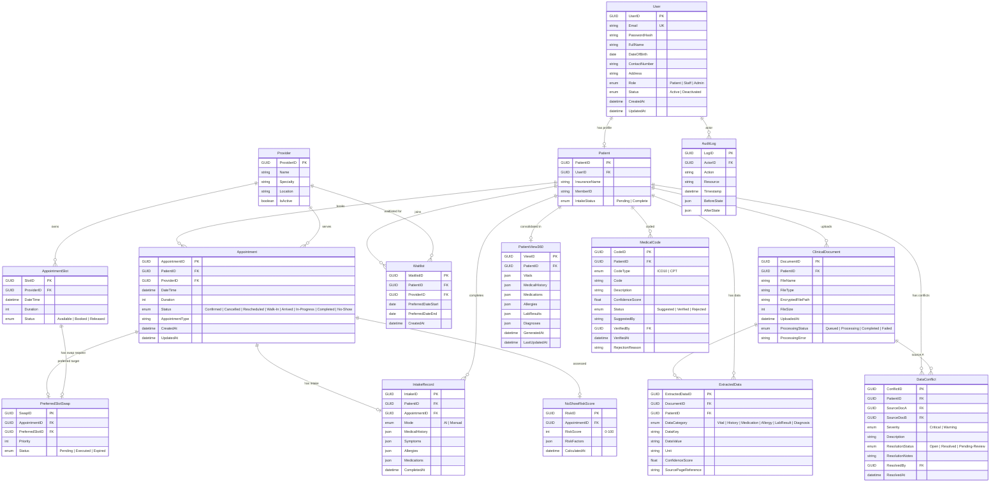
```mermaid
erDiagram
    User {
        GUID UserID PK
        string Email UK
        string PasswordHash
        string FullName
        date DateOfBirth
        string ContactNumber
        string Address
        enum Role "Patient | Staff | Admin"
        enum Status "Active | Deactivated"
        datetime CreatedAt
        datetime UpdatedAt
    }

    Patient {
        GUID PatientID PK
        GUID UserID FK
        string InsuranceName
        string MemberID
        enum IntakeStatus "Pending | Complete"
    }

    Provider {
        GUID ProviderID PK
        string Name
        string Specialty
        string Location
        boolean IsActive
    }

    AppointmentSlot {
        GUID SlotID PK
        GUID ProviderID FK
        datetime DateTime
        int Duration
        enum Status "Available | Booked | Released"
    }

    Appointment {
        GUID AppointmentID PK
        GUID PatientID FK
        GUID ProviderID FK
        datetime DateTime
        int Duration
        enum Status "Confirmed | Cancelled | Rescheduled | Walk-In | Arrived | In-Progress | Completed | No-Show"
        string AppointmentType
        datetime CreatedAt
        datetime UpdatedAt
    }

    PreferredSlotSwap {
        GUID SwapID PK
        GUID AppointmentID FK
        GUID PreferredSlotID FK
        int Priority
        enum Status "Pending | Executed | Expired"
    }

    Waitlist {
        GUID WaitlistID PK
        GUID PatientID FK
        GUID ProviderID FK
        date PreferredDateStart
        date PreferredDateEnd
        datetime CreatedAt
    }

    IntakeRecord {
        GUID IntakeID PK
        GUID PatientID FK
        GUID AppointmentID FK
        enum Mode "AI | Manual"
        json MedicalHistory
        json Symptoms
        json Allergies
        json Medications
        datetime CompletedAt
    }

    ClinicalDocument {
        GUID DocumentID PK
        GUID PatientID FK
        string FileName
        string FileType
        string EncryptedFilePath
        int FileSize
        datetime UploadedAt
        enum ProcessingStatus "Queued | Processing | Completed | Failed"
        string ProcessingError
    }

    ExtractedData {
        GUID ExtractedDataID PK
        GUID DocumentID FK
        GUID PatientID FK
        enum DataCategory "Vital | History | Medication | Allergy | LabResult | Diagnosis"
        string DataKey
        string DataValue
        string Unit
        float ConfidenceScore
        string SourcePageReference
    }

    PatientView360 {
        GUID ViewID PK
        GUID PatientID FK
        json Vitals
        json MedicalHistory
        json Medications
        json Allergies
        json LabResults
        json Diagnoses
        datetime GeneratedAt
        datetime LastUpdatedAt
    }

    DataConflict {
        GUID ConflictID PK
        GUID PatientID FK
        GUID SourceDocA FK
        GUID SourceDocB FK
        enum Severity "Critical | Warning"
        string Description
        enum ResolutionStatus "Open | Resolved | Pending-Review"
        string ResolutionNotes
        GUID ResolvedBy FK
        datetime ResolvedAt
    }

    MedicalCode {
        GUID CodeID PK
        GUID PatientID FK
        enum CodeType "ICD10 | CPT"
        string Code
        string Description
        float ConfidenceScore
        enum Status "Suggested | Verified | Rejected"
        string SuggestedBy
        GUID VerifiedBy FK
        datetime VerifiedAt
        string RejectionReason
    }

    AuditLog {
        GUID LogID PK
        GUID ActorID FK
        string Action
        string Resource
        datetime Timestamp
        json BeforeState
        json AfterState
    }

    NoShowRiskScore {
        GUID RiskID PK
        GUID AppointmentID FK
        int RiskScore "0-100"
        json RiskFactors
        datetime CalculatedAt
    }

    User ||--o| Patient : "has profile"
    Patient ||--o{ Appointment : "books"
    Provider ||--o{ AppointmentSlot : "owns"
    Provider ||--o{ Appointment : "serves"
    Appointment ||--o| PreferredSlotSwap : "has swap request"
    AppointmentSlot ||--o| PreferredSlotSwap : "preferred target"
    Patient ||--o{ Waitlist : "joins"
    Provider ||--o{ Waitlist : "waitlisted for"
    Appointment ||--o| IntakeRecord : "has intake"
    Patient ||--o{ IntakeRecord : "completes"
    Patient ||--o{ ClinicalDocument : "uploads"
    ClinicalDocument ||--o{ ExtractedData : "yields"
    Patient ||--o{ ExtractedData : "has data"
    Patient ||--o| PatientView360 : "consolidated in"
    Patient ||--o{ DataConflict : "has conflicts"
    ClinicalDocument ||--o{ DataConflict : "source A"
    Patient ||--o{ MedicalCode : "coded"
    Appointment ||--o| NoShowRiskScore : "assessed"
    User ||--o{ AuditLog : "actor"
```

### AI Architecture Diagrams

#### RAG Pipeline Diagram

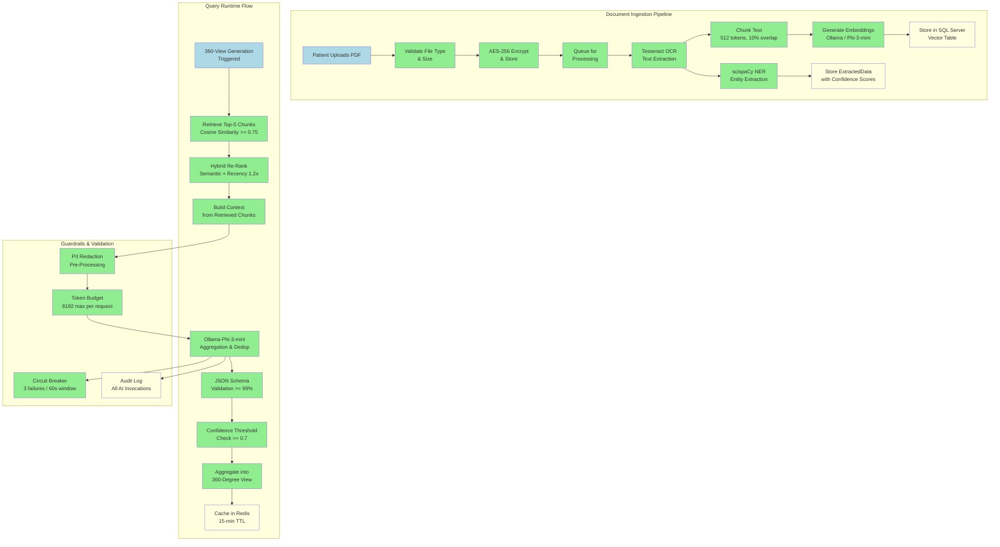
```mermaid
graph TB
  subgraph "Document Ingestion Pipeline"
    Upload[Patient Uploads PDF]:::actor
    Validate[Validate File Type\n& Size]:::core
    Encrypt[AES-256 Encrypt\n& Store]:::core
    Queue[Queue for\nProcessing]:::core
    OCR[Tesseract OCR\nText Extraction]:::core
    Chunk[Chunk Text\n512 tokens, 10% overlap]:::core
    Embed[Generate Embeddings\nOllama / Phi-3-mini]:::core
    StoreVec[Store in SQL Server\nVector Table]:::data
    NER[scispaCy NER\nEntity Extraction]:::core
    StoreData[Store ExtractedData\nwith Confidence Scores]:::data
  end

  subgraph "Query Runtime Flow"
    Trigger[360-View Generation\nTriggered]:::actor
    Retrieve[Retrieve Top-5 Chunks\nCosine Similarity >= 0.75]:::core
    Rerank[Hybrid Re-Rank\nSemantic + Recency 1.2x]:::core
    Context[Build Context\nfrom Retrieved Chunks]:::core
    LLM[Ollama Phi-3-mini\nAggregation & Dedup]:::core
    SchemaVal[JSON Schema\nValidation >= 99%]:::core
    ConfCheck[Confidence Threshold\nCheck >= 0.7]:::core
    Aggregate[Aggregate into\n360-Degree View]:::core
    Cache[Cache in Redis\n15-min TTL]:::data
  end

  subgraph "Guardrails & Validation"
    PIIRedact[PII Redaction\nPre-Processing]:::core
    TokenBudget[Token Budget\n8192 max per request]:::core
    CircuitBreaker[Circuit Breaker\n3 failures / 60s window]:::core
    AuditLog[Audit Log\nAll AI Invocations]:::data
  end

  Upload --> Validate --> Encrypt --> Queue
  Queue --> OCR --> Chunk --> Embed --> StoreVec
  OCR --> NER --> StoreData

  Trigger --> Retrieve --> Rerank --> Context
  Context --> PIIRedact --> TokenBudget --> LLM
  LLM --> SchemaVal --> ConfCheck --> Aggregate --> Cache

  LLM --> CircuitBreaker
  LLM --> AuditLog

  classDef actor fill:#add8e6
  classDef core fill:#90ee90
  classDef data fill:#ffffe0
```

#### AI Tool Calling Architecture

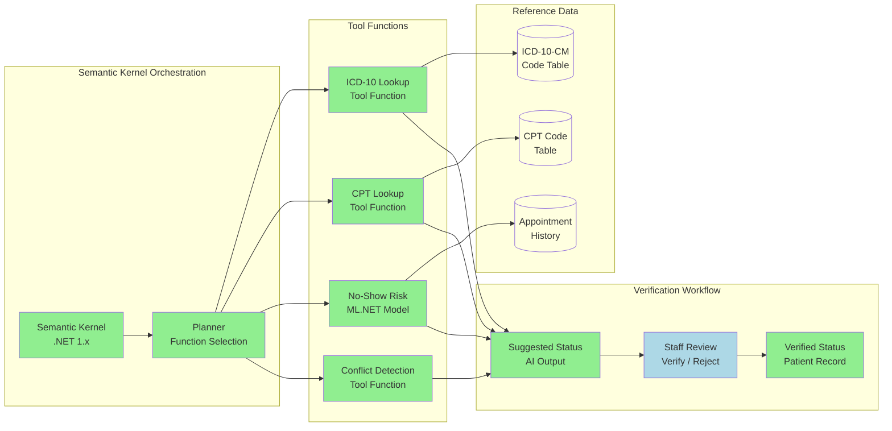
```mermaid
graph LR
  subgraph "Semantic Kernel Orchestration"
    SK[Semantic Kernel\n.NET 1.x]:::core
    Planner[Planner\nFunction Selection]:::core
  end

  subgraph "Tool Functions"
    ICD10[ICD-10 Lookup\nTool Function]:::core
    CPT[CPT Lookup\nTool Function]:::core
    RiskCalc[No-Show Risk\nML.NET Model]:::core
    ConflictScan[Conflict Detection\nTool Function]:::core
  end

  subgraph "Reference Data"
    ICD10DB[(ICD-10-CM\nCode Table)]:::data
    CPTDB[(CPT Code\nTable)]:::data
    ApptHistory[(Appointment\nHistory)]:::data
  end

  subgraph "Verification Workflow"
    Suggest[Suggested Status\nAI Output]:::core
    StaffReview[Staff Review\nVerify / Reject]:::actor
    Verified[Verified Status\nPatient Record]:::core
  end

  SK --> Planner
  Planner --> ICD10
  Planner --> CPT
  Planner --> RiskCalc
  Planner --> ConflictScan

  ICD10 --> ICD10DB
  CPT --> CPTDB
  RiskCalc --> ApptHistory

  ICD10 --> Suggest
  CPT --> Suggest
  RiskCalc --> Suggest
  ConflictScan --> Suggest
  Suggest --> StaffReview --> Verified

  classDef actor fill:#add8e6
  classDef core fill:#90ee90
  classDef data fill:#ffffe0
```

### Use Case Sequence Diagrams

> **Note**: Each sequence diagram below details the dynamic message flow for its corresponding use case defined in spec.md. Use case diagrams remain in spec.md only and are not duplicated here.

#### UC-001: Patient Books Appointment

**Source**: [spec.md#UC-001](.propel/context/docs/spec.md#UC-001)

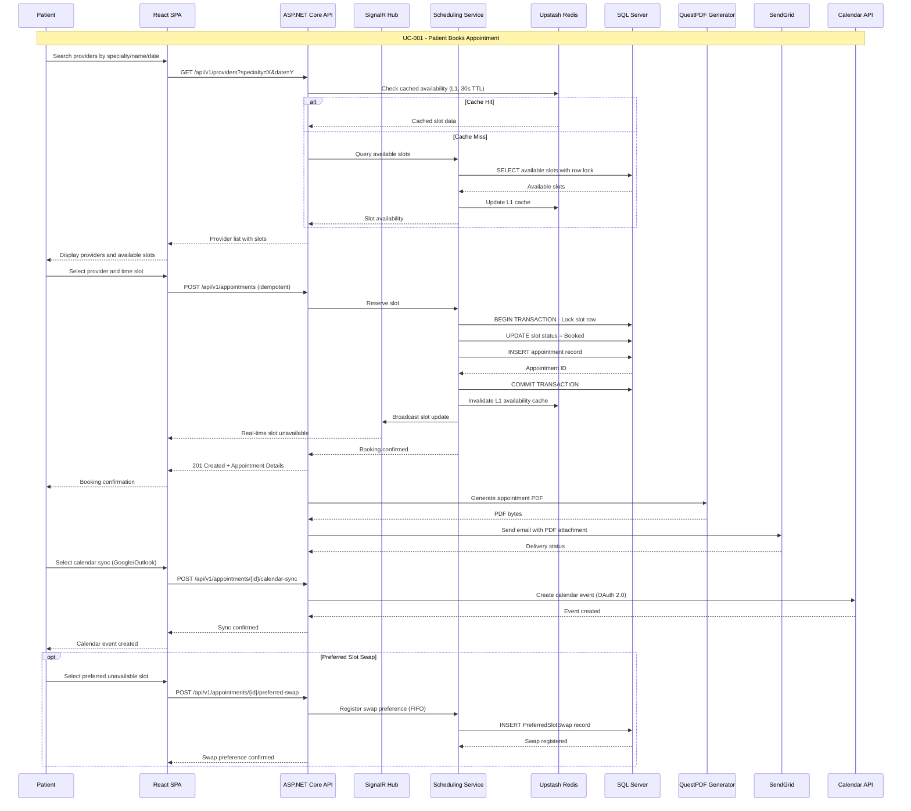
```mermaid
sequenceDiagram
    participant Patient
    participant ReactSPA as React SPA
    participant API as ASP.NET Core API
    participant SignalR as SignalR Hub
    participant SchedService as Scheduling Service
    participant Cache as Upstash Redis
    participant DB as SQL Server
    participant PDFGen as QuestPDF Generator
    participant EmailSvc as SendGrid
    participant CalAPI as Calendar API

    Note over Patient,CalAPI: UC-001 - Patient Books Appointment

    Patient->>ReactSPA: Search providers by specialty/name/date
    ReactSPA->>API: GET /api/v1/providers?specialty=X&date=Y
    API->>Cache: Check cached availability (L1, 30s TTL)
    alt Cache Hit
        Cache-->>API: Cached slot data
    else Cache Miss
        API->>SchedService: Query available slots
        SchedService->>DB: SELECT available slots with row lock
        DB-->>SchedService: Available slots
        SchedService->>Cache: Update L1 cache
        SchedService-->>API: Slot availability
    end
    API-->>ReactSPA: Provider list with slots
    ReactSPA-->>Patient: Display providers and available slots

    Patient->>ReactSPA: Select provider and time slot
    ReactSPA->>API: POST /api/v1/appointments (idempotent)
    API->>SchedService: Reserve slot
    SchedService->>DB: BEGIN TRANSACTION - Lock slot row
    SchedService->>DB: UPDATE slot status = Booked
    SchedService->>DB: INSERT appointment record
    DB-->>SchedService: Appointment ID
    SchedService->>DB: COMMIT TRANSACTION
    SchedService->>Cache: Invalidate L1 availability cache
    SchedService->>SignalR: Broadcast slot update
    SignalR-->>ReactSPA: Real-time slot unavailable

    SchedService-->>API: Booking confirmed
    API-->>ReactSPA: 201 Created + Appointment Details
    ReactSPA-->>Patient: Booking confirmation

    API->>PDFGen: Generate appointment PDF
    PDFGen-->>API: PDF bytes
    API->>EmailSvc: Send email with PDF attachment
    EmailSvc-->>API: Delivery status

    Patient->>ReactSPA: Select calendar sync (Google/Outlook)
    ReactSPA->>API: POST /api/v1/appointments/{id}/calendar-sync
    API->>CalAPI: Create calendar event (OAuth 2.0)
    CalAPI-->>API: Event created
    API-->>ReactSPA: Sync confirmed
    ReactSPA-->>Patient: Calendar event created

    opt Preferred Slot Swap
        Patient->>ReactSPA: Select preferred unavailable slot
        ReactSPA->>API: POST /api/v1/appointments/{id}/preferred-swap
        API->>SchedService: Register swap preference (FIFO)
        SchedService->>DB: INSERT PreferredSlotSwap record
        DB-->>SchedService: Swap registered
        API-->>ReactSPA: Swap preference confirmed
    end
```

#### UC-002: Patient Completes Digital Intake (AI Conversational)

**Source**: [spec.md#UC-002](.propel/context/docs/spec.md#UC-002)

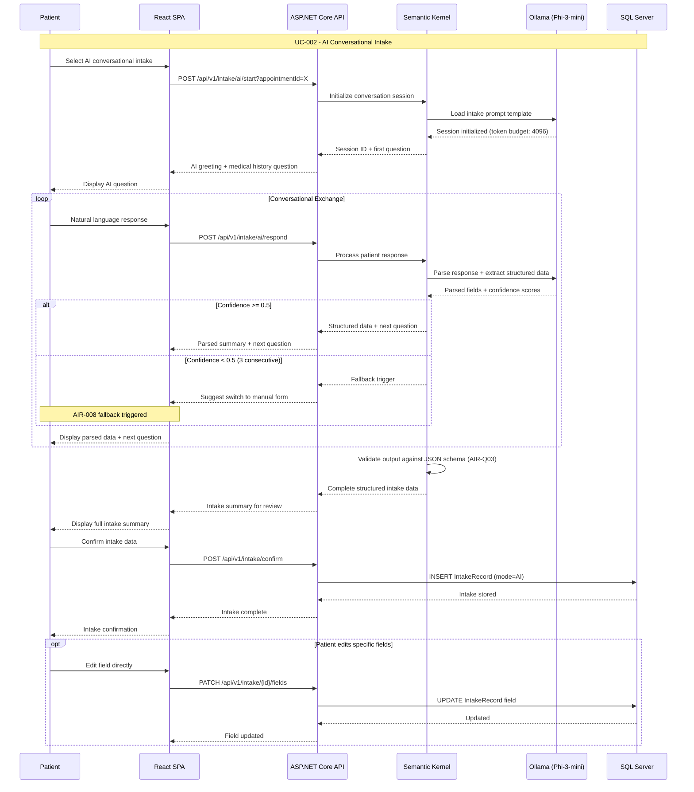
```mermaid
sequenceDiagram
    participant Patient
    participant ReactSPA as React SPA
    participant API as ASP.NET Core API
    participant SK as Semantic Kernel
    participant Ollama as Ollama (Phi-3-mini)
    participant DB as SQL Server

    Note over Patient,DB: UC-002 - AI Conversational Intake

    Patient->>ReactSPA: Select AI conversational intake
    ReactSPA->>API: POST /api/v1/intake/ai/start?appointmentId=X
    API->>SK: Initialize conversation session
    SK->>Ollama: Load intake prompt template
    Ollama-->>SK: Session initialized (token budget: 4096)
    SK-->>API: Session ID + first question
    API-->>ReactSPA: AI greeting + medical history question
    ReactSPA-->>Patient: Display AI question

    loop Conversational Exchange
        Patient->>ReactSPA: Natural language response
        ReactSPA->>API: POST /api/v1/intake/ai/respond
        API->>SK: Process patient response
        SK->>Ollama: Parse response + extract structured data
        Ollama-->>SK: Parsed fields + confidence scores

        alt Confidence >= 0.5
            SK-->>API: Structured data + next question
            API-->>ReactSPA: Parsed summary + next question
        else Confidence < 0.5 (3 consecutive)
            SK-->>API: Fallback trigger
            API-->>ReactSPA: Suggest switch to manual form
            Note over Patient,ReactSPA: AIR-008 fallback triggered
        end
        ReactSPA-->>Patient: Display parsed data + next question
    end

    SK->>SK: Validate output against JSON schema (AIR-Q03)
    SK-->>API: Complete structured intake data
    API-->>ReactSPA: Intake summary for review
    ReactSPA-->>Patient: Display full intake summary

    Patient->>ReactSPA: Confirm intake data
    ReactSPA->>API: POST /api/v1/intake/confirm
    API->>DB: INSERT IntakeRecord (mode=AI)
    DB-->>API: Intake stored
    API-->>ReactSPA: Intake complete
    ReactSPA-->>Patient: Intake confirmation

    opt Patient edits specific fields
        Patient->>ReactSPA: Edit field directly
        ReactSPA->>API: PATCH /api/v1/intake/{id}/fields
        API->>DB: UPDATE IntakeRecord field
        DB-->>API: Updated
        API-->>ReactSPA: Field updated
    end
```

#### UC-003: Patient Completes Digital Intake (Manual Form)

**Source**: [spec.md#UC-003](.propel/context/docs/spec.md#UC-003)

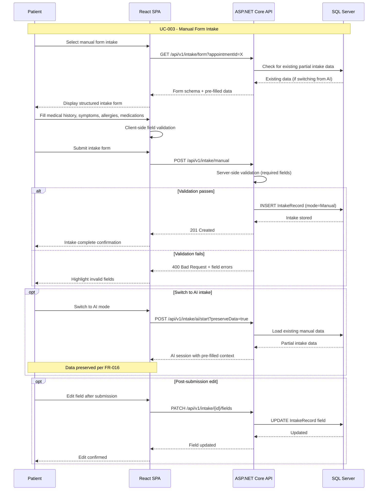
```mermaid
sequenceDiagram
    participant Patient
    participant ReactSPA as React SPA
    participant API as ASP.NET Core API
    participant DB as SQL Server

    Note over Patient,DB: UC-003 - Manual Form Intake

    Patient->>ReactSPA: Select manual form intake
    ReactSPA->>API: GET /api/v1/intake/form?appointmentId=X
    API->>DB: Check for existing partial intake data
    DB-->>API: Existing data (if switching from AI)
    API-->>ReactSPA: Form schema + pre-filled data
    ReactSPA-->>Patient: Display structured intake form

    Patient->>ReactSPA: Fill medical history, symptoms, allergies, medications
    ReactSPA->>ReactSPA: Client-side field validation

    Patient->>ReactSPA: Submit intake form
    ReactSPA->>API: POST /api/v1/intake/manual
    API->>API: Server-side validation (required fields)

    alt Validation passes
        API->>DB: INSERT IntakeRecord (mode=Manual)
        DB-->>API: Intake stored
        API-->>ReactSPA: 201 Created
        ReactSPA-->>Patient: Intake complete confirmation
    else Validation fails
        API-->>ReactSPA: 400 Bad Request + field errors
        ReactSPA-->>Patient: Highlight invalid fields
    end

    opt Switch to AI intake
        Patient->>ReactSPA: Switch to AI mode
        ReactSPA->>API: POST /api/v1/intake/ai/start?preserveData=true
        API->>DB: Load existing manual data
        DB-->>API: Partial intake data
        API-->>ReactSPA: AI session with pre-filled context
        Note over Patient,ReactSPA: Data preserved per FR-016
    end

    opt Post-submission edit
        Patient->>ReactSPA: Edit field after submission
        ReactSPA->>API: PATCH /api/v1/intake/{id}/fields
        API->>DB: UPDATE IntakeRecord field
        DB-->>API: Updated
        API-->>ReactSPA: Field updated
        ReactSPA-->>Patient: Edit confirmed
    end
```

#### UC-004: System Executes Preferred Slot Swap

**Source**: [spec.md#UC-004](.propel/context/docs/spec.md#UC-004)

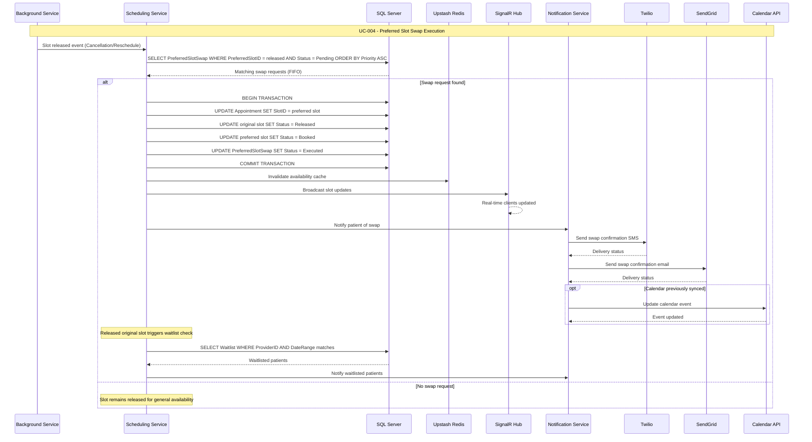
```mermaid
sequenceDiagram
    participant System as Background Service
    participant SchedService as Scheduling Service
    participant DB as SQL Server
    participant Cache as Upstash Redis
    participant SignalR as SignalR Hub
    participant NotifySvc as Notification Service
    participant SMS as Twilio
    participant Email as SendGrid
    participant CalAPI as Calendar API

    Note over System,CalAPI: UC-004 - Preferred Slot Swap Execution

    System->>SchedService: Slot released event (Cancellation/Reschedule)
    SchedService->>DB: SELECT PreferredSlotSwap WHERE PreferredSlotID = released AND Status = Pending ORDER BY Priority ASC
    DB-->>SchedService: Matching swap requests (FIFO)

    alt Swap request found
        SchedService->>DB: BEGIN TRANSACTION
        SchedService->>DB: UPDATE Appointment SET SlotID = preferred slot
        SchedService->>DB: UPDATE original slot SET Status = Released
        SchedService->>DB: UPDATE preferred slot SET Status = Booked
        SchedService->>DB: UPDATE PreferredSlotSwap SET Status = Executed
        SchedService->>DB: COMMIT TRANSACTION

        SchedService->>Cache: Invalidate availability cache
        SchedService->>SignalR: Broadcast slot updates
        SignalR-->>SignalR: Real-time clients updated

        SchedService->>NotifySvc: Notify patient of swap
        NotifySvc->>SMS: Send swap confirmation SMS
        SMS-->>NotifySvc: Delivery status
        NotifySvc->>Email: Send swap confirmation email
        Email-->>NotifySvc: Delivery status

        opt Calendar previously synced
            NotifySvc->>CalAPI: Update calendar event
            CalAPI-->>NotifySvc: Event updated
        end

        Note over SchedService: Released original slot triggers waitlist check
        SchedService->>DB: SELECT Waitlist WHERE ProviderID AND DateRange matches
        DB-->>SchedService: Waitlisted patients
        SchedService->>NotifySvc: Notify waitlisted patients
    else No swap request
        Note over SchedService: Slot remains released for general availability
    end
```

#### UC-005: Staff Books Walk-In Appointment

**Source**: [spec.md#UC-005](.propel/context/docs/spec.md#UC-005)

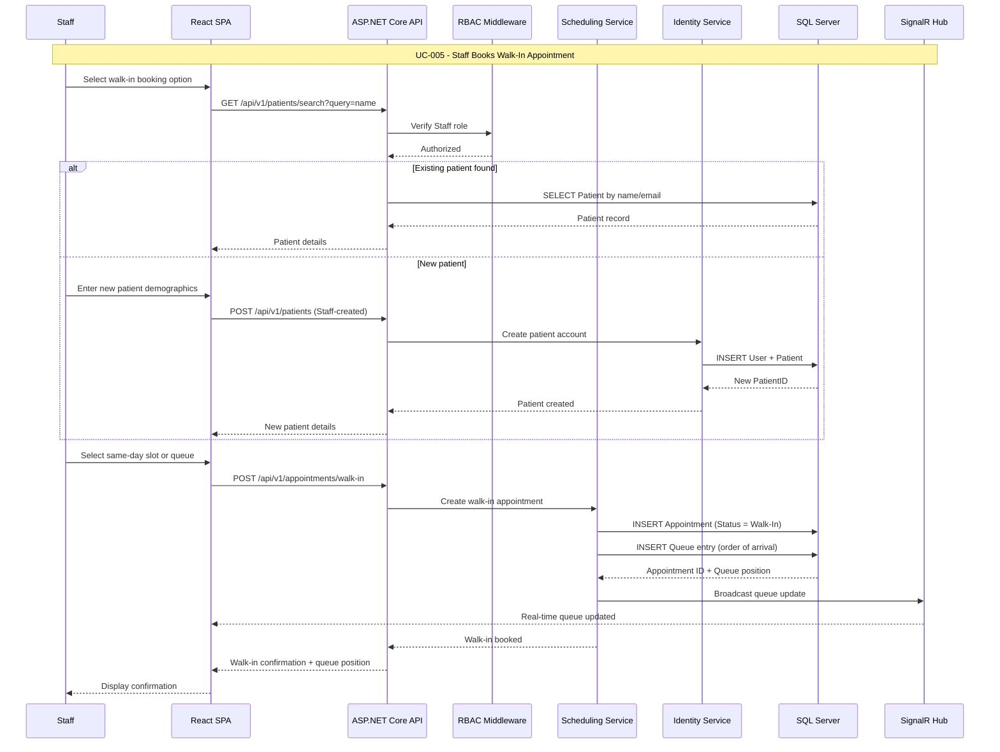
```mermaid
sequenceDiagram
    participant Staff
    participant ReactSPA as React SPA
    participant API as ASP.NET Core API
    participant AuthMW as RBAC Middleware
    participant SchedService as Scheduling Service
    participant IdentService as Identity Service
    participant DB as SQL Server
    participant SignalR as SignalR Hub

    Note over Staff,SignalR: UC-005 - Staff Books Walk-In Appointment

    Staff->>ReactSPA: Select walk-in booking option
    ReactSPA->>API: GET /api/v1/patients/search?query=name
    API->>AuthMW: Verify Staff role
    AuthMW-->>API: Authorized

    alt Existing patient found
        API->>DB: SELECT Patient by name/email
        DB-->>API: Patient record
        API-->>ReactSPA: Patient details
    else New patient
        Staff->>ReactSPA: Enter new patient demographics
        ReactSPA->>API: POST /api/v1/patients (Staff-created)
        API->>IdentService: Create patient account
        IdentService->>DB: INSERT User + Patient
        DB-->>IdentService: New PatientID
        IdentService-->>API: Patient created
        API-->>ReactSPA: New patient details
    end

    Staff->>ReactSPA: Select same-day slot or queue
    ReactSPA->>API: POST /api/v1/appointments/walk-in
    API->>SchedService: Create walk-in appointment
    SchedService->>DB: INSERT Appointment (Status = Walk-In)
    SchedService->>DB: INSERT Queue entry (order of arrival)
    DB-->>SchedService: Appointment ID + Queue position
    SchedService->>SignalR: Broadcast queue update
    SignalR-->>ReactSPA: Real-time queue updated
    SchedService-->>API: Walk-in booked
    API-->>ReactSPA: Walk-in confirmation + queue position
    ReactSPA-->>Staff: Display confirmation
```

#### UC-006: Staff Manages Same-Day Queue

**Source**: [spec.md#UC-006](.propel/context/docs/spec.md#UC-006)

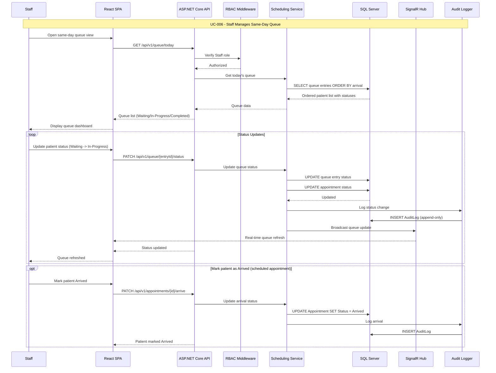
```mermaid
sequenceDiagram
    participant Staff
    participant ReactSPA as React SPA
    participant API as ASP.NET Core API
    participant AuthMW as RBAC Middleware
    participant SchedService as Scheduling Service
    participant DB as SQL Server
    participant SignalR as SignalR Hub
    participant AuditSvc as Audit Logger

    Note over Staff,AuditSvc: UC-006 - Staff Manages Same-Day Queue

    Staff->>ReactSPA: Open same-day queue view
    ReactSPA->>API: GET /api/v1/queue/today
    API->>AuthMW: Verify Staff role
    AuthMW-->>API: Authorized
    API->>SchedService: Get today's queue
    SchedService->>DB: SELECT queue entries ORDER BY arrival
    DB-->>SchedService: Ordered patient list with statuses
    SchedService-->>API: Queue data
    API-->>ReactSPA: Queue list (Waiting/In-Progress/Completed)
    ReactSPA-->>Staff: Display queue dashboard

    loop Status Updates
        Staff->>ReactSPA: Update patient status (Waiting -> In-Progress)
        ReactSPA->>API: PATCH /api/v1/queue/{entryId}/status
        API->>SchedService: Update queue status
        SchedService->>DB: UPDATE queue entry status
        SchedService->>DB: UPDATE appointment status
        DB-->>SchedService: Updated
        SchedService->>AuditSvc: Log status change
        AuditSvc->>DB: INSERT AuditLog (append-only)
        SchedService->>SignalR: Broadcast queue update
        SignalR-->>ReactSPA: Real-time queue refresh
        API-->>ReactSPA: Status updated
        ReactSPA-->>Staff: Queue refreshed
    end

    opt Mark patient as Arrived (scheduled appointment)
        Staff->>ReactSPA: Mark patient Arrived
        ReactSPA->>API: PATCH /api/v1/appointments/{id}/arrive
        API->>SchedService: Update arrival status
        SchedService->>DB: UPDATE Appointment SET Status = Arrived
        SchedService->>AuditSvc: Log arrival
        AuditSvc->>DB: INSERT AuditLog
        API-->>ReactSPA: Patient marked Arrived
    end
```

#### UC-007: System Sends Appointment Reminders

**Source**: [spec.md#UC-007](.propel/context/docs/spec.md#UC-007)

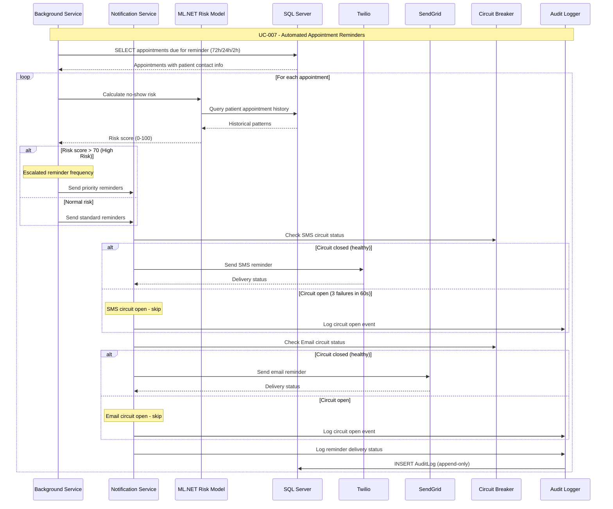
```mermaid
sequenceDiagram
    participant Scheduler as Background Service
    participant NotifySvc as Notification Service
    participant RiskModel as ML.NET Risk Model
    participant DB as SQL Server
    participant SMS as Twilio
    participant Email as SendGrid
    participant CircuitBrk as Circuit Breaker
    participant AuditSvc as Audit Logger

    Note over Scheduler,AuditSvc: UC-007 - Automated Appointment Reminders

    Scheduler->>DB: SELECT appointments due for reminder (72h/24h/2h)
    DB-->>Scheduler: Appointments with patient contact info

    loop For each appointment
        Scheduler->>RiskModel: Calculate no-show risk
        RiskModel->>DB: Query patient appointment history
        DB-->>RiskModel: Historical patterns
        RiskModel-->>Scheduler: Risk score (0-100)

        alt Risk score > 70 (High Risk)
            Note over Scheduler: Escalated reminder frequency
            Scheduler->>NotifySvc: Send priority reminders
        else Normal risk
            Scheduler->>NotifySvc: Send standard reminders
        end

        NotifySvc->>CircuitBrk: Check SMS circuit status
        alt Circuit closed (healthy)
            NotifySvc->>SMS: Send SMS reminder
            SMS-->>NotifySvc: Delivery status
        else Circuit open (3 failures in 60s)
            Note over NotifySvc: SMS circuit open - skip
            NotifySvc->>AuditSvc: Log circuit open event
        end

        NotifySvc->>CircuitBrk: Check Email circuit status
        alt Circuit closed (healthy)
            NotifySvc->>Email: Send email reminder
            Email-->>NotifySvc: Delivery status
        else Circuit open
            Note over NotifySvc: Email circuit open - skip
            NotifySvc->>AuditSvc: Log circuit open event
        end

        NotifySvc->>AuditSvc: Log reminder delivery status
        AuditSvc->>DB: INSERT AuditLog (append-only)
    end
```

#### UC-008: Patient Uploads Clinical Documents

**Source**: [spec.md#UC-008](.propel/context/docs/spec.md#UC-008)

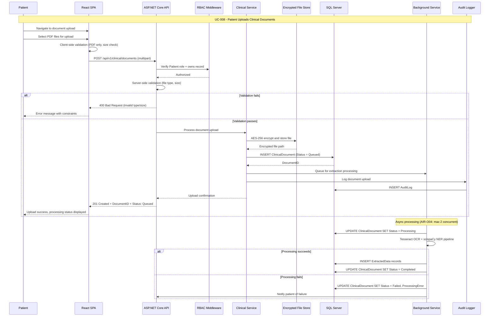
```mermaid
sequenceDiagram
    participant Patient
    participant ReactSPA as React SPA
    participant API as ASP.NET Core API
    participant AuthMW as RBAC Middleware
    participant ClinService as Clinical Service
    participant FileStore as Encrypted File Store
    participant DB as SQL Server
    participant BgService as Background Service
    participant AuditSvc as Audit Logger

    Note over Patient,AuditSvc: UC-008 - Patient Uploads Clinical Documents

    Patient->>ReactSPA: Navigate to document upload
    Patient->>ReactSPA: Select PDF files for upload
    ReactSPA->>ReactSPA: Client-side validation (PDF only, size check)

    ReactSPA->>API: POST /api/v1/clinical/documents (multipart)
    API->>AuthMW: Verify Patient role + owns record
    AuthMW-->>API: Authorized

    API->>API: Server-side validation (file type, size)
    alt Validation fails
        API-->>ReactSPA: 400 Bad Request (invalid type/size)
        ReactSPA-->>Patient: Error message with constraints
    else Validation passes
        API->>ClinService: Process document upload
        ClinService->>FileStore: AES-256 encrypt and store file
        FileStore-->>ClinService: Encrypted file path
        ClinService->>DB: INSERT ClinicalDocument (Status = Queued)
        DB-->>ClinService: DocumentID
        ClinService->>BgService: Queue for extraction processing
        ClinService->>AuditSvc: Log document upload
        AuditSvc->>DB: INSERT AuditLog
        ClinService-->>API: Upload confirmation
        API-->>ReactSPA: 201 Created + DocumentID + Status: Queued
        ReactSPA-->>Patient: Upload success, processing status displayed
    end

    Note over BgService: Async processing (AIR-O04: max 2 concurrent)
    BgService->>DB: UPDATE ClinicalDocument SET Status = Processing
    BgService->>BgService: Tesseract OCR + scispaCy NER pipeline
    alt Processing succeeds
        BgService->>DB: INSERT ExtractedData records
        BgService->>DB: UPDATE ClinicalDocument SET Status = Completed
    else Processing fails
        BgService->>DB: UPDATE ClinicalDocument SET Status = Failed, ProcessingError
        BgService->>API: Notify patient of failure
    end
```

#### UC-009: System Generates 360-Degree Patient View

**Source**: [spec.md#UC-009](.propel/context/docs/spec.md#UC-009)

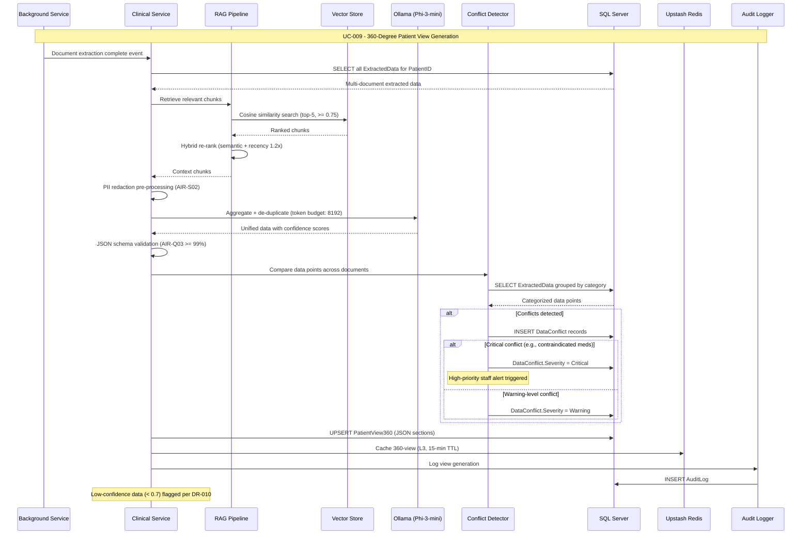
```mermaid
sequenceDiagram
    participant BgService as Background Service
    participant ClinService as Clinical Service
    participant RAGPipeline as RAG Pipeline
    participant VectorDB as Vector Store
    participant Ollama as Ollama (Phi-3-mini)
    participant ConflictSvc as Conflict Detector
    participant DB as SQL Server
    participant Cache as Upstash Redis
    participant AuditSvc as Audit Logger

    Note over BgService,AuditSvc: UC-009 - 360-Degree Patient View Generation

    BgService->>ClinService: Document extraction complete event
    ClinService->>DB: SELECT all ExtractedData for PatientID
    DB-->>ClinService: Multi-document extracted data

    ClinService->>RAGPipeline: Retrieve relevant chunks
    RAGPipeline->>VectorDB: Cosine similarity search (top-5, >= 0.75)
    VectorDB-->>RAGPipeline: Ranked chunks
    RAGPipeline->>RAGPipeline: Hybrid re-rank (semantic + recency 1.2x)
    RAGPipeline-->>ClinService: Context chunks

    ClinService->>ClinService: PII redaction pre-processing (AIR-S02)
    ClinService->>Ollama: Aggregate + de-duplicate (token budget: 8192)
    Ollama-->>ClinService: Unified data with confidence scores

    ClinService->>ClinService: JSON schema validation (AIR-Q03 >= 99%)

    ClinService->>ConflictSvc: Compare data points across documents
    ConflictSvc->>DB: SELECT ExtractedData grouped by category
    DB-->>ConflictSvc: Categorized data points

    alt Conflicts detected
        ConflictSvc->>DB: INSERT DataConflict records
        alt Critical conflict (e.g., contraindicated meds)
            ConflictSvc->>DB: DataConflict.Severity = Critical
            Note over ConflictSvc: High-priority staff alert triggered
        else Warning-level conflict
            ConflictSvc->>DB: DataConflict.Severity = Warning
        end
    end

    ClinService->>DB: UPSERT PatientView360 (JSON sections)
    ClinService->>Cache: Cache 360-view (L3, 15-min TTL)
    ClinService->>AuditSvc: Log view generation
    AuditSvc->>DB: INSERT AuditLog

    Note over ClinService: Low-confidence data (< 0.7) flagged per DR-010
```

#### UC-010: System Maps Medical Codes (ICD-10/CPT)

**Source**: [spec.md#UC-010](.propel/context/docs/spec.md#UC-010)

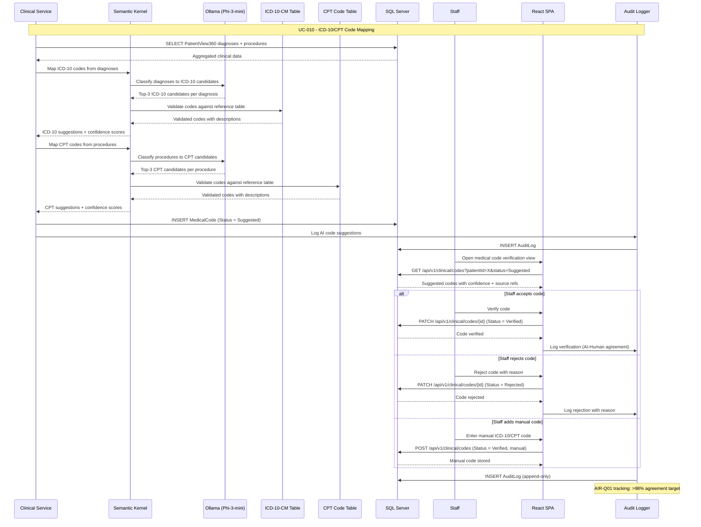
```mermaid
sequenceDiagram
    participant ClinService as Clinical Service
    participant SK as Semantic Kernel
    participant Ollama as Ollama (Phi-3-mini)
    participant ICD10Table as ICD-10-CM Table
    participant CPTTable as CPT Code Table
    participant DB as SQL Server
    participant Staff
    participant ReactSPA as React SPA
    participant AuditSvc as Audit Logger

    Note over ClinService,AuditSvc: UC-010 - ICD-10/CPT Code Mapping

    ClinService->>DB: SELECT PatientView360 diagnoses + procedures
    DB-->>ClinService: Aggregated clinical data

    ClinService->>SK: Map ICD-10 codes from diagnoses
    SK->>Ollama: Classify diagnoses to ICD-10 candidates
    Ollama-->>SK: Top-3 ICD-10 candidates per diagnosis
    SK->>ICD10Table: Validate codes against reference table
    ICD10Table-->>SK: Validated codes with descriptions
    SK-->>ClinService: ICD-10 suggestions + confidence scores

    ClinService->>SK: Map CPT codes from procedures
    SK->>Ollama: Classify procedures to CPT candidates
    Ollama-->>SK: Top-3 CPT candidates per procedure
    SK->>CPTTable: Validate codes against reference table
    CPTTable-->>SK: Validated codes with descriptions
    SK-->>ClinService: CPT suggestions + confidence scores

    ClinService->>DB: INSERT MedicalCode (Status = Suggested)
    ClinService->>AuditSvc: Log AI code suggestions
    AuditSvc->>DB: INSERT AuditLog

    Staff->>ReactSPA: Open medical code verification view
    ReactSPA->>DB: GET /api/v1/clinical/codes?patientId=X&status=Suggested
    DB-->>ReactSPA: Suggested codes with confidence + source refs

    alt Staff accepts code
        Staff->>ReactSPA: Verify code
        ReactSPA->>DB: PATCH /api/v1/clinical/codes/{id} (Status = Verified)
        DB-->>ReactSPA: Code verified
        ReactSPA->>AuditSvc: Log verification (AI-Human agreement)
    else Staff rejects code
        Staff->>ReactSPA: Reject code with reason
        ReactSPA->>DB: PATCH /api/v1/clinical/codes/{id} (Status = Rejected)
        DB-->>ReactSPA: Code rejected
        ReactSPA->>AuditSvc: Log rejection with reason
    else Staff adds manual code
        Staff->>ReactSPA: Enter manual ICD-10/CPT code
        ReactSPA->>DB: POST /api/v1/clinical/codes (Status = Verified, manual)
        DB-->>ReactSPA: Manual code stored
    end

    AuditSvc->>DB: INSERT AuditLog (append-only)
    Note over AuditSvc: AIR-Q01 tracking: >98% agreement target
```

#### UC-011: Staff Resolves Data Conflicts

**Source**: [spec.md#UC-011](.propel/context/docs/spec.md#UC-011)

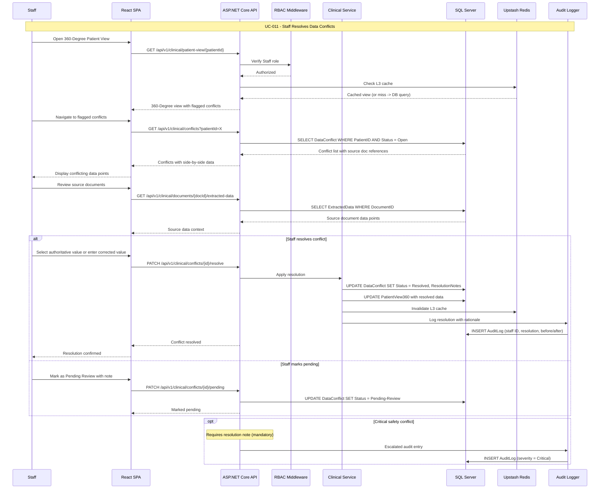
```mermaid
sequenceDiagram
    participant Staff
    participant ReactSPA as React SPA
    participant API as ASP.NET Core API
    participant AuthMW as RBAC Middleware
    participant ClinService as Clinical Service
    participant DB as SQL Server
    participant Cache as Upstash Redis
    participant AuditSvc as Audit Logger

    Note over Staff,AuditSvc: UC-011 - Staff Resolves Data Conflicts

    Staff->>ReactSPA: Open 360-Degree Patient View
    ReactSPA->>API: GET /api/v1/clinical/patient-view/{patientId}
    API->>AuthMW: Verify Staff role
    AuthMW-->>API: Authorized
    API->>Cache: Check L3 cache
    Cache-->>API: Cached view (or miss -> DB query)
    API-->>ReactSPA: 360-Degree view with flagged conflicts

    Staff->>ReactSPA: Navigate to flagged conflicts
    ReactSPA->>API: GET /api/v1/clinical/conflicts?patientId=X
    API->>DB: SELECT DataConflict WHERE PatientID AND Status = Open
    DB-->>API: Conflict list with source doc references
    API-->>ReactSPA: Conflicts with side-by-side data
    ReactSPA-->>Staff: Display conflicting data points

    Staff->>ReactSPA: Review source documents
    ReactSPA->>API: GET /api/v1/clinical/documents/{docId}/extracted-data
    API->>DB: SELECT ExtractedData WHERE DocumentID
    DB-->>API: Source document data points
    API-->>ReactSPA: Source data context

    alt Staff resolves conflict
        Staff->>ReactSPA: Select authoritative value or enter corrected value
        ReactSPA->>API: PATCH /api/v1/clinical/conflicts/{id}/resolve
        API->>ClinService: Apply resolution
        ClinService->>DB: UPDATE DataConflict SET Status = Resolved, ResolutionNotes
        ClinService->>DB: UPDATE PatientView360 with resolved data
        ClinService->>Cache: Invalidate L3 cache
        ClinService->>AuditSvc: Log resolution with rationale
        AuditSvc->>DB: INSERT AuditLog (staff ID, resolution, before/after)
        API-->>ReactSPA: Conflict resolved
        ReactSPA-->>Staff: Resolution confirmed
    else Staff marks pending
        Staff->>ReactSPA: Mark as Pending Review with note
        ReactSPA->>API: PATCH /api/v1/clinical/conflicts/{id}/pending
        API->>DB: UPDATE DataConflict SET Status = Pending-Review
        API-->>ReactSPA: Marked pending
    end

    opt Critical safety conflict
        Note over API: Requires resolution note (mandatory)
        API->>AuditSvc: Escalated audit entry
        AuditSvc->>DB: INSERT AuditLog (severity = Critical)
    end
```

#### UC-012: Admin Manages Users

**Source**: [spec.md#UC-012](.propel/context/docs/spec.md#UC-012)

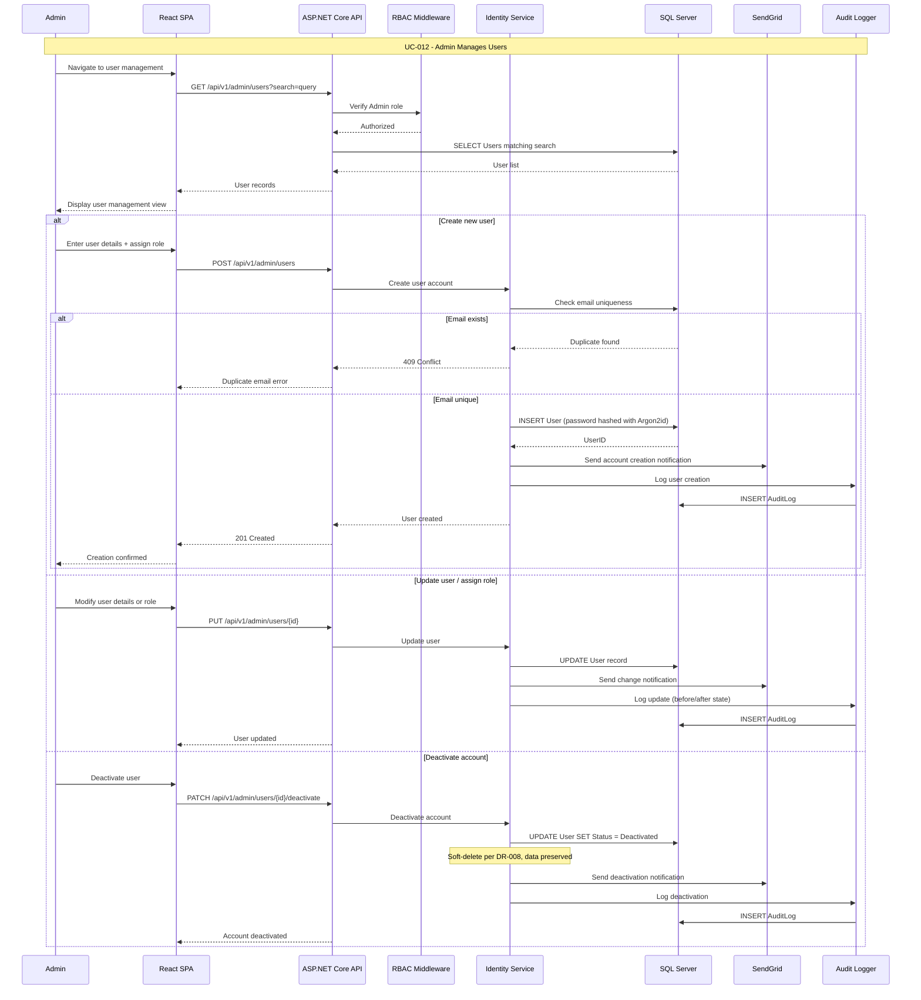
```mermaid
sequenceDiagram
    participant Admin
    participant ReactSPA as React SPA
    participant API as ASP.NET Core API
    participant AuthMW as RBAC Middleware
    participant IdentService as Identity Service
    participant DB as SQL Server
    participant EmailSvc as SendGrid
    participant AuditSvc as Audit Logger

    Note over Admin,AuditSvc: UC-012 - Admin Manages Users

    Admin->>ReactSPA: Navigate to user management
    ReactSPA->>API: GET /api/v1/admin/users?search=query
    API->>AuthMW: Verify Admin role
    AuthMW-->>API: Authorized
    API->>DB: SELECT Users matching search
    DB-->>API: User list
    API-->>ReactSPA: User records
    ReactSPA-->>Admin: Display user management view

    alt Create new user
        Admin->>ReactSPA: Enter user details + assign role
        ReactSPA->>API: POST /api/v1/admin/users
        API->>IdentService: Create user account
        IdentService->>DB: Check email uniqueness
        alt Email exists
            DB-->>IdentService: Duplicate found
            IdentService-->>API: 409 Conflict
            API-->>ReactSPA: Duplicate email error
        else Email unique
            IdentService->>DB: INSERT User (password hashed with Argon2id)
            DB-->>IdentService: UserID
            IdentService->>EmailSvc: Send account creation notification
            IdentService->>AuditSvc: Log user creation
            AuditSvc->>DB: INSERT AuditLog
            IdentService-->>API: User created
            API-->>ReactSPA: 201 Created
            ReactSPA-->>Admin: Creation confirmed
        end
    else Update user / assign role
        Admin->>ReactSPA: Modify user details or role
        ReactSPA->>API: PUT /api/v1/admin/users/{id}
        API->>IdentService: Update user
        IdentService->>DB: UPDATE User record
        IdentService->>EmailSvc: Send change notification
        IdentService->>AuditSvc: Log update (before/after state)
        AuditSvc->>DB: INSERT AuditLog
        API-->>ReactSPA: User updated
    else Deactivate account
        Admin->>ReactSPA: Deactivate user
        ReactSPA->>API: PATCH /api/v1/admin/users/{id}/deactivate
        API->>IdentService: Deactivate account
        IdentService->>DB: UPDATE User SET Status = Deactivated
        Note over IdentService: Soft-delete per DR-008, data preserved
        IdentService->>EmailSvc: Send deactivation notification
        IdentService->>AuditSvc: Log deactivation
        AuditSvc->>DB: INSERT AuditLog
        API-->>ReactSPA: Account deactivated
    end
```

#### UC-013: System Performs Insurance Pre-Check

**Source**: [spec.md#UC-013](.propel/context/docs/spec.md#UC-013)

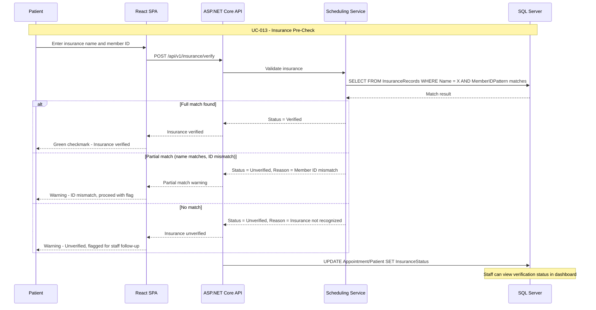
```mermaid
sequenceDiagram
    participant Patient
    participant ReactSPA as React SPA
    participant API as ASP.NET Core API
    participant SchedService as Scheduling Service
    participant DB as SQL Server

    Note over Patient,DB: UC-013 - Insurance Pre-Check

    Patient->>ReactSPA: Enter insurance name and member ID
    ReactSPA->>API: POST /api/v1/insurance/verify
    API->>SchedService: Validate insurance
    SchedService->>DB: SELECT FROM InsuranceRecords WHERE Name = X AND MemberIDPattern matches
    DB-->>SchedService: Match result

    alt Full match found
        SchedService-->>API: Status = Verified
        API-->>ReactSPA: Insurance verified
        ReactSPA-->>Patient: Green checkmark - Insurance verified
    else Partial match (name matches, ID mismatch)
        SchedService-->>API: Status = Unverified, Reason = Member ID mismatch
        API-->>ReactSPA: Partial match warning
        ReactSPA-->>Patient: Warning - ID mismatch, proceed with flag
    else No match
        SchedService-->>API: Status = Unverified, Reason = Insurance not recognized
        API-->>ReactSPA: Insurance unverified
        ReactSPA-->>Patient: Warning - Unverified, flagged for staff follow-up
    end

    API->>DB: UPDATE Appointment/Patient SET InsuranceStatus
    Note over DB: Staff can view verification status in dashboard
```

#### UC-014: Patient Syncs Appointment to Calendar

**Source**: [spec.md#UC-014](.propel/context/docs/spec.md#UC-014)

```mermaid
sequenceDiagram
    participant Patient
    participant ReactSPA as React SPA
    participant API as ASP.NET Core API
    participant CalService as Calendar Sync Service
    participant DB as SQL Server
    participant CircuitBrk as Circuit Breaker
    participant GoogleCal as Google Calendar API
    participant OutlookCal as Microsoft Graph API

    Note over Patient,OutlookCal: UC-014 - Calendar Sync

    Patient->>ReactSPA: Select calendar sync after booking
    ReactSPA-->>Patient: Choose Google Calendar or Outlook

    alt Google Calendar selected
        Patient->>ReactSPA: Select Google Calendar
        ReactSPA->>API: POST /api/v1/appointments/{id}/calendar-sync?provider=google
        API->>CalService: Initiate Google Calendar sync
        CalService->>DB: Check for existing OAuth token
        alt Token exists and valid
            DB-->>CalService: OAuth token
        else Token missing or expired
            CalService-->>API: Redirect to OAuth flow
            API-->>ReactSPA: OAuth redirect URL
            ReactSPA-->>Patient: Google authorization page
            Patient->>GoogleCal: Authorize access
            GoogleCal-->>ReactSPA: Authorization code
            ReactSPA->>API: POST /api/v1/auth/google/callback
            API->>GoogleCal: Exchange code for token
            GoogleCal-->>API: OAuth token
            API->>DB: Store encrypted OAuth token (A-6)
        end
        CalService->>CircuitBrk: Check Google API circuit
        alt Circuit closed
            CalService->>GoogleCal: POST calendar event (provider, date, time, location)
            GoogleCal-->>CalService: Event created
            CalService->>DB: Store calendar event ID for future updates
            CalService-->>API: Sync successful
        else Circuit open
            CalService-->>API: Sync queued for retry
            API-->>ReactSPA: Sync pending notification
        end
    else Outlook Calendar selected
        Patient->>ReactSPA: Select Outlook Calendar
        ReactSPA->>API: POST /api/v1/appointments/{id}/calendar-sync?provider=outlook
        API->>CalService: Initiate Outlook sync
        CalService->>DB: Check for existing OAuth token
        alt Token exists and valid
            DB-->>CalService: OAuth token
        else Token missing or expired
            CalService-->>API: Redirect to OAuth flow
            API-->>ReactSPA: Microsoft authorization page
            Patient->>OutlookCal: Authorize access
            OutlookCal-->>ReactSPA: Authorization code
            ReactSPA->>API: POST /api/v1/auth/microsoft/callback
            API->>OutlookCal: Exchange code for token
            OutlookCal-->>API: OAuth token
            API->>DB: Store encrypted OAuth token
        end
        CalService->>CircuitBrk: Check Microsoft Graph circuit
        alt Circuit closed
            CalService->>OutlookCal: POST calendar event
            OutlookCal-->>CalService: Event created
            CalService->>DB: Store calendar event ID
            CalService-->>API: Sync successful
        else Circuit open
            CalService-->>API: Sync queued for retry
        end
    end

    API-->>ReactSPA: Calendar sync status
    ReactSPA-->>Patient: Sync confirmation
```
