## Feature Goal

Build a unified, standalone healthcare platform that bridges patient scheduling and clinical data management. The end state delivers a modern, patient-centric appointment booking system integrated with a Trust-First clinical intelligence engine that consolidates unstructured clinical documents into a verified 360-Degree Patient View with ICD-10 and CPT code mappings. The current state is a fragmented landscape where booking tools lack clinical context, clinical prep requires 20+ minutes of manual data extraction, and no-show rates reach 15% due to complex booking processes.

## Business Justification

- Reduces no-show rates from a 15% baseline through smart reminders, waitlist management, and dynamic preferred slot swaps, directly recovering lost revenue and improving schedule utilization.
- Eliminates the 20-minute manual clinical data extraction bottleneck by automating document parsing and aggregation, freeing clinical staff for patient-facing tasks.
- Addresses the market gap of disconnected scheduling and clinical data tools by providing a single platform with end-to-end data lifecycle support from booking through post-visit consolidation.
- Delivers a Trust-First approach to AI-generated clinical data by requiring human verification, overcoming the Black Box trust deficit present in competing tools.
- Serves three distinct user roles (Patient, Staff, Admin) with role-appropriate workflows that reduce friction and administrative overhead.

## Feature Scope

The platform provides the following user-visible behaviors and technical capabilities within Phase 1:

- **Patient Self-Service Booking**: Patients search for providers, select appointment slots, optionally request a preferred unavailable slot for automatic swap, and complete digital intake via AI conversational or manual form pathways.
- **Staff Operations**: Front desk and call center staff handle walk-in bookings, manage same-day queues, and mark patients as arrived. Patients cannot self-check in.
- **Appointment Lifecycle**: The system sends automated multi-channel reminders (SMS/Email), generates appointment PDF confirmations, and syncs with Google/Outlook calendars.
- **Insurance Pre-Check**: Soft validation of insurance name and ID against an internal set of predefined dummy records.
- **Clinical Data Aggregation**: Patients upload historical clinical documents (multi-format PDFs). The system extracts structured data (vitals, history, medications) and generates a de-duplicated 360-Degree Patient View.
- **Medical Coding**: The system maps ICD-10 and CPT codes from aggregated patient data for clinical staff verification.
- **Conflict Resolution**: The system explicitly highlights critical data conflicts (e.g., conflicting medications) across multiple documents.
- **Admin Controls**: Admins manage user accounts and roles.
- **Security & Compliance**: HIPAA-compliant data handling with encryption, role-based access control, immutable audit logging, and 15-minute session auto-timeout.

**Technology Stack**: React (Frontend), .NET (Backend API), SQL Server (Data), free/open-source hosting (Netlify, Vercel, GitHub Codespaces, or equivalent), Upstash Redis (caching).

**Out of Scope**: Provider logins, payment gateway, family profiles, patient self-check-in, bi-directional EHR integration, full claims submission, paid cloud infrastructure.

### Success Criteria

- [ ] Demonstrable reduction in baseline no-show rate (target: measurable decrease from 15%)
- [ ] Decrease in staff administrative time per appointment
- [ ] High volume of patient dashboards created and appointments successfully booked
- [ ] AI-Human Agreement Rate of >98% for suggested clinical data and medical codes
- [ ] Quantifiable metric of Critical Conflicts Identified tracking prevented safety risks and claim denials
- [ ] 99.9% platform uptime
- [ ] 100% HIPAA-compliant data handling, transmission, and storage

## GenAI Suitability Triage

| Feature Area                                       | Classification | Rationale                                                     |
| -------------------------------------------------- | -------------- | ------------------------------------------------------------- |
| User Registration & Authentication                 | DETERMINISTIC  | Rule-based validation and session management                  |
| Appointment Booking & Slot Management              | DETERMINISTIC  | Exact scheduling logic, availability checks                   |
| Dynamic Preferred Slot Swap                        | DETERMINISTIC  | Rule-based conditional swap with deterministic triggers       |
| Walk-in Booking & Queue Management                 | DETERMINISTIC  | Staff-driven CRUD operations                                  |
| Patient Arrival Marking                            | DETERMINISTIC  | Simple status update                                          |
| AI Conversational Intake                           | AI-CANDIDATE   | Natural language understanding, conversational flow           |
| Manual Form Intake                                 | DETERMINISTIC  | Standard form submission                                      |
| Insurance Pre-Check                                | DETERMINISTIC  | Lookup against predefined records                             |
| Multi-Channel Reminders                            | DETERMINISTIC  | Scheduled event-driven notifications                          |
| Calendar Sync                                      | DETERMINISTIC  | API-based calendar integration                                |
| PDF Appointment Confirmation                       | DETERMINISTIC  | Template-based document generation                            |
| Clinical Document Upload & Parsing                 | AI-CANDIDATE   | Unstructured PDF extraction, OCR, NLP                         |
| Structured Data Extraction (Vitals, History, Meds) | AI-CANDIDATE   | Named Entity Recognition from clinical text                   |
| 360-Degree Patient View Generation                 | AI-CANDIDATE   | Data aggregation and de-duplication from unstructured sources |
| Data Conflict Detection & Highlighting             | HYBRID         | AI surfaces conflicts, clinical staff resolves                |
| ICD-10 Code Mapping                                | AI-CANDIDATE   | Classification from unstructured clinical data                |
| CPT Code Mapping                                   | AI-CANDIDATE   | Classification from unstructured clinical data                |
| No-Show Risk Assessment                            | HYBRID         | AI predicts risk score, system applies rule-based actions     |
| Role-Based Access Control                          | DETERMINISTIC  | Policy enforcement                                            |
| Immutable Audit Logging                            | DETERMINISTIC  | Append-only event capture                                     |
| Data Encryption & HIPAA Compliance                 | DETERMINISTIC  | Standard cryptographic operations                             |

**AI-CANDIDATE Features**: Conversational intake, clinical document parsing, structured data extraction, 360-degree view generation, ICD-10 mapping, CPT mapping.
**HYBRID Features**: Data conflict detection (AI detects, human resolves), no-show risk assessment (AI predicts, rules act).
**DETERMINISTIC Features**: All booking, scheduling, queue management, notifications, calendar sync, insurance check, RBAC, audit logging, session management.

## Functional Requirements

### Authentication and User Management

- FR-001: [DETERMINISTIC] System MUST allow patients to register accounts using email with validation, capturing required demographic information (name, date of birth, contact number, address).
- FR-002: [DETERMINISTIC] System MUST authenticate users via email and password with role-based access enforcement for three roles: Patient, Staff, and Admin.
- FR-003: [DETERMINISTIC] System MUST enforce automatic session timeout after 15 minutes of inactivity, requiring re-authentication to continue.
- FR-004: [DETERMINISTIC] System MUST allow Admin users to create, update, and deactivate user accounts and assign roles (Patient, Staff, Admin).

### Appointment Booking

- FR-005: [DETERMINISTIC] System MUST allow patients to search for available providers by specialty, provider name, and date range, displaying real-time slot availability.
- FR-006: [DETERMINISTIC] System MUST display available appointment slots with provider details, date, time, and location, updating in real time as slots are booked or released.
- FR-007: [DETERMINISTIC] System MUST allow patients to select and confirm an available appointment slot, recording the booking with a unique appointment ID, patient ID, provider, date, time, and status.
- FR-008: [DETERMINISTIC] System MUST implement the Dynamic Preferred Slot Swap feature where a patient can select a currently unavailable preferred slot alongside a confirmed available slot; if the preferred slot becomes available, the system MUST automatically swap the appointment, release the original slot, and notify the patient.
- FR-009: [DETERMINISTIC] System MUST maintain a waitlist for fully booked providers or time slots and MUST automatically notify waitlisted patients when a slot becomes available in their preferred window.
- FR-010: [DETERMINISTIC] System MUST allow patients and staff to cancel or reschedule existing appointments, releasing the original slot back to the availability pool and triggering waitlist notifications.
- FR-011: [DETERMINISTIC] System MUST restrict walk-in appointment booking to Staff users only, with the option to create a new patient account during the walk-in booking process.
- FR-012: [DETERMINISTIC] System MUST allow Staff users to manage a same-day queue, displaying the ordered list of walk-in and same-day patients with status indicators (waiting, in-progress, completed).
- FR-013: [DETERMINISTIC] System MUST allow only Staff users to mark a patient as "Arrived" for a scheduled appointment; the system MUST NOT provide patient self-check-in via app, web portal, or QR code.

### Patient Intake

- FR-014: [AI-CANDIDATE] System MUST provide an AI-assisted conversational intake option that collects patient medical history, current symptoms, allergies, and medications through natural language dialogue, parsing responses into structured data fields.
- FR-015: [DETERMINISTIC] System MUST provide a traditional manual form-based intake option with structured fields for medical history, current symptoms, allergies, and medications as a fallback to the AI conversational intake.
- FR-016: [DETERMINISTIC] System MUST allow patients to freely switch between AI conversational intake and manual form intake at any point during the intake process without data loss, preserving all previously entered information.
- FR-017: [DETERMINISTIC] System MUST allow patients to edit any intake data at any time without requiring staff assistance, providing direct field-level editing capabilities.

### Insurance Verification

- FR-018: [DETERMINISTIC] System MUST perform a soft insurance pre-check by validating the patient-provided insurance name and member ID against an internal predefined set of dummy insurance records, returning a pass/fail validation status with reason.

### Notifications and Calendar Integration

- FR-019: [DETERMINISTIC] System MUST send automated appointment reminders through both SMS and Email channels at configurable intervals (default: 72 hours, 24 hours, and 2 hours before the appointment).
- FR-020: [DETERMINISTIC] System MUST sync confirmed appointments to the patient's Google Calendar using the free Google Calendar API, creating calendar events with appointment details.
- FR-021: [DETERMINISTIC] System MUST sync confirmed appointments to the patient's Outlook Calendar using the free Outlook Calendar API, creating calendar events with appointment details.
- FR-022: [DETERMINISTIC] System MUST generate a PDF document containing full appointment details (provider, date, time, location, preparation instructions) and deliver it to the patient via email upon booking confirmation.

### Clinical Data Aggregation

- FR-023: [AI-CANDIDATE] System MUST accept patient-uploaded clinical documents in PDF format (including scanned/image-based PDFs) and extract text content using OCR and NLP processing pipelines.
- FR-024: [AI-CANDIDATE] System MUST extract structured clinical data from uploaded documents, identifying and categorizing: patient vitals, medical history, current medications, allergies, lab results, and diagnoses with associated confidence scores for each extracted data point.
- FR-025: [AI-CANDIDATE] System MUST generate a unified 360-Degree Patient View by aggregating and de-duplicating extracted data across all uploaded documents for a given patient, presenting a single consolidated clinical profile.
- FR-026: [HYBRID] System MUST detect and explicitly highlight critical data conflicts across multiple uploaded documents (e.g., conflicting medication lists, inconsistent allergy records, contradictory diagnoses), flagging them for clinical staff review with source document references.

### Medical Coding

- FR-027: [AI-CANDIDATE] System MUST map relevant ICD-10-CM codes based on diagnoses and conditions identified in the aggregated 360-Degree Patient View, presenting suggested codes with confidence scores for clinical staff verification.
- FR-028: [AI-CANDIDATE] System MUST map relevant CPT codes based on procedures and encounters identified in the aggregated patient data, presenting suggested codes with confidence scores for clinical staff verification.

### Risk Assessment

- FR-029: [HYBRID] System MUST calculate a no-show risk score for each booked appointment based on patient history, appointment type, time slot, and other relevant factors, presenting the risk level to staff and triggering automated reminder escalation for high-risk appointments.

### Security and Compliance

- FR-030: [DETERMINISTIC] System MUST encrypt all Protected Health Information (PHI) using AES-256 encryption at rest and TLS 1.2+ encryption in transit, ensuring 100% HIPAA-compliant data handling.
- FR-031: [DETERMINISTIC] System MUST maintain immutable audit logs for all user actions involving patient data, recording actor identity, action type, timestamp, affected resource, and before/after states.
- FR-032: [DETERMINISTIC] System MUST enforce role-based access control ensuring patients can only access their own data, staff can access patient data within their scope, and admins have full user management but follow the minimum necessary standard for PHI access.

## Use Case Analysis

### Actors and System Boundary

- **Patient**: A registered user who books appointments, completes digital intake, uploads clinical documents, and views their consolidated health profile. Cannot perform walk-in bookings or mark arrivals.
- **Staff (Front Desk/Call Center)**: An authorized user who manages walk-in bookings, same-day queues, marks patient arrivals, and reviews clinical data conflicts. Can optionally create patient accounts.
- **Admin**: An authorized user who manages user accounts, assigns roles, and oversees system configuration and audit logs.
- **Google Calendar API**: External system that receives appointment event data for patient calendar synchronization.
- **Outlook Calendar API**: External system that receives appointment event data for patient calendar synchronization.
- **SMS Gateway**: External system that delivers appointment reminder text messages.
- **Email Service**: External system that delivers appointment reminder emails and PDF confirmations.
- **AI/NLP Engine**: Internal subsystem that processes conversational intake, extracts clinical data from documents, and maps medical codes.

### Use Case Specifications

#### UC-001: Patient Books Appointment

- **Actor(s)**: Patient
- **Goal**: Book an appointment with a healthcare provider for a preferred date and time
- **Preconditions**: Patient is registered and authenticated; at least one provider has available slots
- **Success Scenario**:
  1. Patient navigates to the appointment booking interface
  2. Patient searches for providers by specialty, name, or date range
  3. System displays matching providers with real-time available slots
  4. Patient selects a provider and an available time slot
  5. System presents booking confirmation with appointment details
  6. Patient confirms the booking
  7. System records the appointment, generates a unique appointment ID, and updates slot availability
  8. System generates an appointment PDF and sends it via email
  9. System prompts patient for calendar sync preference
- **Extensions/Alternatives**:
  - 4a. Patient also selects a preferred unavailable slot for the Dynamic Preferred Slot Swap: System registers the swap preference and confirms both the booked slot and the swap request
  - 4b. No slots available for selected criteria: System offers waitlist enrollment and alternative date suggestions
  - 6a. Patient cancels before confirming: System releases the held slot back to available pool
  - 9a. Patient opts for Google Calendar sync: System creates calendar event via Google Calendar API
  - 9b. Patient opts for Outlook Calendar sync: System creates calendar event via Outlook Calendar API
- **Postconditions**: Appointment is recorded with status "Confirmed"; slot is marked unavailable; patient receives PDF via email; calendar event is created if opted; waitlist is notified if a slot was released

##### Use Case Diagram

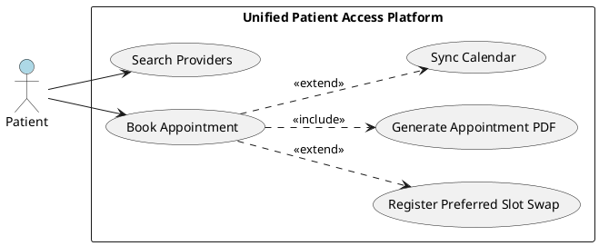

#### UC-002: Patient Completes Digital Intake (AI Conversational)

- **Actor(s)**: Patient, AI/NLP Engine
- **Goal**: Complete pre-visit intake by providing medical history, symptoms, allergies, and medications through an AI-guided conversation
- **Preconditions**: Patient has a confirmed appointment; patient selects AI conversational intake mode
- **Success Scenario**:
  1. Patient selects AI conversational intake option
  2. AI/NLP Engine initiates a guided conversational flow
  3. AI/NLP Engine asks contextual questions about medical history, current symptoms, allergies, and medications
  4. Patient provides responses in natural language
  5. AI/NLP Engine parses responses into structured data fields
  6. System displays parsed intake summary for patient review
  7. Patient reviews and confirms the intake data
- **Extensions/Alternatives**:
  - 3a. AI cannot parse a response: AI requests clarification or rephrasing
  - 4a. Patient switches to manual form at any point: System preserves all previously collected data and pre-fills the manual form (UC-003)
  - 7a. Patient edits specific fields: System allows direct field-level editing without restarting the intake
- **Postconditions**: Structured intake data is stored against the patient's appointment record; intake status is marked complete

##### Use Case Diagram

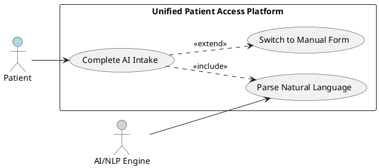

#### UC-003: Patient Completes Digital Intake (Manual Form)

- **Actor(s)**: Patient
- **Goal**: Complete pre-visit intake by filling out a structured manual form
- **Preconditions**: Patient has a confirmed appointment; patient selects manual intake mode or switches from AI intake
- **Success Scenario**:
  1. Patient selects manual form intake option (or switches from AI intake)
  2. System displays structured intake form with fields for medical history, symptoms, allergies, and medications
  3. If switching from AI intake, system pre-fills fields with previously collected data
  4. Patient completes remaining fields and reviews all entered data
  5. Patient submits the intake form
  6. System validates required fields and stores intake data
- **Extensions/Alternatives**:
  - 4a. Patient switches to AI conversational mode: System preserves all manually entered data and passes context to AI engine (UC-002)
  - 5a. Validation failure on required fields: System highlights missing/invalid fields and prompts correction
  - 6a. Patient edits intake data after submission: System allows field-level editing without requiring staff assistance
- **Postconditions**: Structured intake data is stored against the patient's appointment record; intake status is marked complete

##### Use Case Diagram

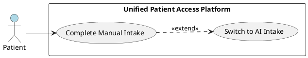

#### UC-004: System Executes Preferred Slot Swap

- **Actor(s)**: Patient (passive recipient), System (automated)
- **Goal**: Automatically swap a patient's confirmed appointment to their preferred slot when it becomes available
- **Preconditions**: Patient has an active appointment with a registered preferred slot swap request; the preferred slot is currently unavailable
- **Success Scenario**:
  1. A cancellation or schedule change releases the patient's preferred slot
  2. System identifies matching preferred slot swap requests for the released slot
  3. System evaluates swap eligibility (first-registered priority)
  4. System swaps the appointment from the original slot to the preferred slot
  5. System releases the original slot back to the availability pool
  6. System notifies the patient of the successful swap via SMS and Email
  7. System updates calendar events if previously synced
- **Extensions/Alternatives**:
  - 3a. Multiple patients have the same preferred slot: System uses first-registered (FIFO) priority to select the swap recipient; remaining patients retain their original slots
  - 4a. Preferred slot is no longer compatible (e.g., provider change): System retains original appointment and removes the swap request, notifying the patient
- **Postconditions**: Patient's appointment is updated to the preferred slot; original slot is released and available; waitlist is notified of the released slot; patient is notified of the change

##### Use Case Diagram

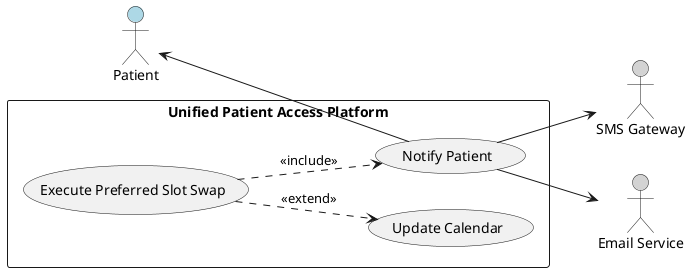

#### UC-005: Staff Books Walk-In Appointment

- **Actor(s)**: Staff
- **Goal**: Register a walk-in patient for a same-day appointment
- **Preconditions**: Staff user is authenticated; same-day provider availability exists or queue is open
- **Success Scenario**:
  1. Staff selects walk-in booking option
  2. Staff searches for existing patient record or initiates new patient creation
  3. If new patient: Staff enters patient demographics and creates account
  4. Staff selects available same-day slot or adds patient to the queue
  5. System records the walk-in appointment with status "Walk-In"
  6. System adds patient to same-day queue in order of arrival
- **Extensions/Alternatives**:
  - 2a. Patient does not have an account and declines account creation: Staff proceeds with minimal demographic capture for the visit only
  - 4a. No same-day slots available: Staff adds patient to wait queue with estimated wait time
- **Postconditions**: Walk-in appointment is recorded; patient appears in same-day queue; staff can proceed with intake

##### Use Case Diagram

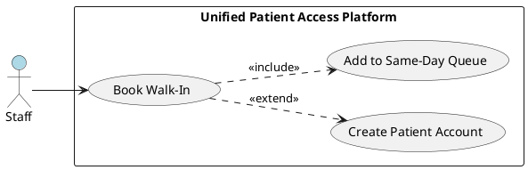

#### UC-006: Staff Manages Same-Day Queue

- **Actor(s)**: Staff
- **Goal**: View, reorder, and update the status of patients in the same-day walk-in queue
- **Preconditions**: Staff user is authenticated; at least one patient is in the same-day queue
- **Success Scenario**:
  1. Staff opens the same-day queue management view
  2. System displays ordered list of patients with status indicators (Waiting, In-Progress, Completed)
  3. Staff updates patient status as patients are seen (Waiting → In-Progress → Completed)
  4. System updates queue display in real time
- **Extensions/Alternatives**:
  - 3a. Staff marks patient as "Arrived" for a scheduled appointment: System updates appointment status and timestamps arrival
  - 3b. Patient leaves without being seen: Staff marks patient as "No-Show" or "Left"
- **Postconditions**: Queue reflects current patient statuses; arrival times and status changes are audit-logged

##### Use Case Diagram

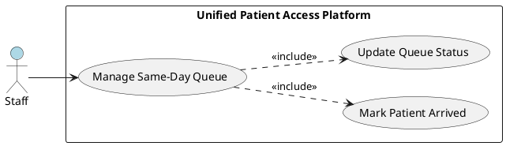

#### UC-007: System Sends Appointment Reminders

- **Actor(s)**: System (automated), SMS Gateway, Email Service
- **Goal**: Reduce no-show rate by sending multi-channel reminders at configured intervals before appointments
- **Preconditions**: Patient has a confirmed appointment with a future date; patient has valid contact information (phone and/or email)
- **Success Scenario**:
  1. System scheduler triggers reminder evaluation at configured intervals (72h, 24h, 2h before appointment)
  2. System identifies appointments due for reminder at the current interval
  3. System sends SMS reminder via SMS Gateway
  4. System sends Email reminder via Email Service
  5. System logs reminder delivery status for each channel
- **Extensions/Alternatives**:
  - 3a. SMS delivery fails: System logs failure and retries once; if still failing, relies on email channel
  - 4a. Email delivery fails: System logs failure and retries once; if still failing, relies on SMS channel
  - 5a. High no-show risk appointment (from FR-029): System sends additional reminder at closer intervals
- **Postconditions**: Reminders are delivered via both channels; delivery statuses are logged; high-risk appointments receive escalated reminders

##### Use Case Diagram

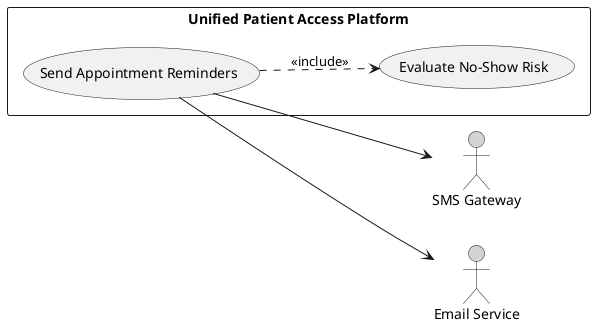

#### UC-008: Patient Uploads Clinical Documents

- **Actor(s)**: Patient
- **Goal**: Upload historical clinical documents (PDFs) for data extraction and profile consolidation
- **Preconditions**: Patient is authenticated; patient has clinical documents in PDF format
- **Success Scenario**:
  1. Patient navigates to the document upload interface
  2. Patient selects one or more PDF files for upload
  3. System validates file type (PDF only) and file size constraints
  4. System uploads and securely stores the documents with encryption
  5. System queues documents for clinical data extraction processing
  6. System displays upload confirmation with processing status
- **Extensions/Alternatives**:
  - 3a. Invalid file type: System rejects upload and displays supported format message
  - 3b. File exceeds size limit: System rejects upload and displays size constraint
  - 5a. Processing fails for a document: System notifies patient to re-upload or try an alternative format
- **Postconditions**: Documents are securely stored and encrypted; extraction pipeline is triggered; patient can track processing status

##### Use Case Diagram

#### UC-009: System Generates 360-Degree Patient View

- **Actor(s)**: System (automated), AI/NLP Engine
- **Goal**: Aggregate extracted clinical data from all uploaded documents into a unified, de-duplicated patient profile
- **Preconditions**: At least one clinical document has been successfully processed and data extracted for the patient
- **Success Scenario**:
  1. AI/NLP Engine completes data extraction from uploaded documents
  2. System aggregates extracted data points across all documents for the patient
  3. System runs de-duplication logic to identify and merge equivalent entries
  4. System detects conflicts across documents (e.g., different medication dosages, contradictory allergies)
  5. System generates the 360-Degree Patient View with categorized sections: vitals, medical history, medications, allergies, lab results, diagnoses
  6. System flags detected conflicts with source document references for clinical staff review
  7. System presents the consolidated view to authorized users with confidence scores per data point
- **Extensions/Alternatives**:
  - 3a. Low-confidence extraction on a data point: System marks the data point with a low-confidence indicator and source reference
  - 4a. Critical conflict detected (e.g., contraindicated medications): System generates a high-priority alert for staff
- **Postconditions**: Unified 360-Degree Patient View is available; conflicts are flagged; confidence scores are displayed; audit log records view generation

##### Use Case Diagram

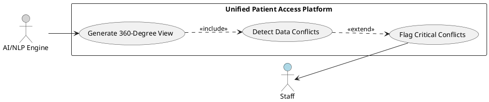

#### UC-010: System Maps Medical Codes (ICD-10/CPT)

- **Actor(s)**: AI/NLP Engine, Staff (verifier)
- **Goal**: Automatically map ICD-10 and CPT codes from aggregated patient clinical data for staff verification
- **Preconditions**: 360-Degree Patient View has been generated with extracted diagnoses and procedures
- **Success Scenario**:
  1. System passes extracted diagnoses and procedures from the 360-Degree Patient View to the AI/NLP Engine
  2. AI/NLP Engine identifies applicable ICD-10-CM codes for each diagnosis with confidence scores
  3. AI/NLP Engine identifies applicable CPT codes for each procedure/encounter with confidence scores
  4. System presents suggested codes alongside the clinical data with source references
  5. Staff reviews and verifies or corrects the suggested codes
  6. System records verified codes against the patient record
- **Extensions/Alternatives**:
  - 2a. AI confidence is below threshold for a code: System marks the code as requires-review with alternative suggestions
  - 5a. Staff rejects a suggested code: System logs the rejection with reason and allows manual code entry
  - 5b. Staff adds additional codes not suggested by AI: System records manually added codes with staff attribution
- **Postconditions**: Verified ICD-10 and CPT codes are recorded against the patient; AI-Human agreement is logged for accuracy metrics

##### Use Case Diagram

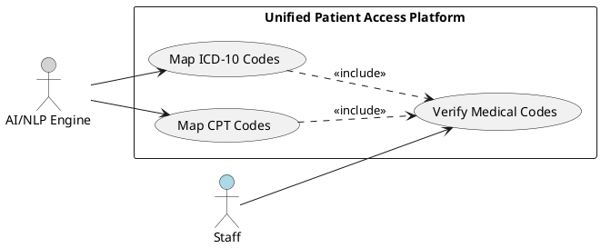

#### UC-011: Staff Resolves Data Conflicts

- **Actor(s)**: Staff
- **Goal**: Review and resolve flagged data conflicts in the 360-Degree Patient View
- **Preconditions**: 360-Degree Patient View has been generated with at least one flagged conflict
- **Success Scenario**:
  1. Staff opens the 360-Degree Patient View and navigates to flagged conflicts
  2. System displays conflicting data points side-by-side with source document references
  3. Staff reviews source documents for context
  4. Staff selects the authoritative data point or enters a corrected value
  5. System updates the patient view with the resolved data, retaining conflict history
- **Extensions/Alternatives**:
  - 4a. Staff cannot resolve without additional information: Staff marks conflict as "Pending Review" with a note
  - 4b. Conflict involves a critical safety issue (e.g., medication contraindication): System requires a resolution note and escalates to audit log
- **Postconditions**: Conflict is resolved or marked pending; resolution is audit-logged with staff identity and rationale; patient view is updated

##### Use Case Diagram

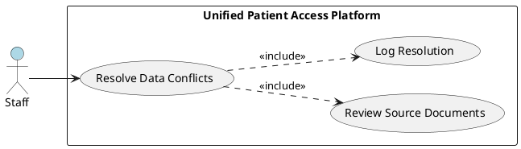

#### UC-012: Admin Manages Users

- **Actor(s)**: Admin
- **Goal**: Create, update, deactivate user accounts and manage role assignments
- **Preconditions**: Admin user is authenticated with Admin role
- **Success Scenario**:
  1. Admin navigates to the user management interface
  2. Admin searches for an existing user or initiates new user creation
  3. Admin sets or modifies user details (name, email, role)
  4. Admin assigns or changes the user role (Patient, Staff, Admin)
  5. System validates and saves the changes
  6. System sends notification to the affected user about account changes
- **Extensions/Alternatives**:
  - 3a. Admin deactivates a user account: System disables login for the user while preserving data for audit purposes
  - 5a. Duplicate email detected: System rejects creation and displays existing account reference
- **Postconditions**: User account is created/updated/deactivated; role is assigned; action is audit-logged; affected user is notified

##### Use Case Diagram

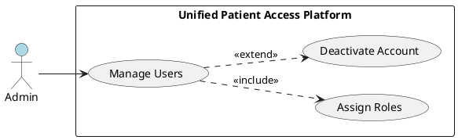

#### UC-013: System Performs Insurance Pre-Check

- **Actor(s)**: Patient
- **Goal**: Validate patient-provided insurance information before appointment confirmation
- **Preconditions**: Patient is in the booking or intake flow; system has an internal set of predefined dummy insurance records
- **Success Scenario**:
  1. Patient enters insurance provider name and member ID during booking or intake
  2. System queries the internal predefined insurance record set
  3. System matches the provided insurance name and member ID
  4. System returns a validation status of "Verified" and displays confirmation to patient
- **Extensions/Alternatives**:
  - 3a. No match found for insurance name or member ID: System returns "Unverified" status with a reason message; patient can proceed with booking but the status is flagged for staff follow-up
  - 3b. Partial match (name matches, ID does not): System returns "Unverified" with specific mismatch details
- **Postconditions**: Insurance validation status is recorded against the patient's appointment; staff can view verification status

##### Use Case Diagram

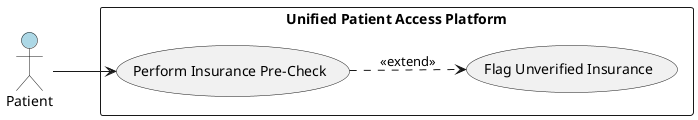

#### UC-014: Patient Syncs Appointment to Calendar

- **Actor(s)**: Patient, Google Calendar API, Outlook Calendar API
- **Goal**: Synchronize a confirmed appointment to the patient's external calendar
- **Preconditions**: Patient has a confirmed appointment; patient has authorized calendar access
- **Success Scenario**:
  1. Patient selects calendar sync option after booking confirmation
  2. Patient chooses Google Calendar or Outlook Calendar
  3. System authenticates with the chosen calendar API using OAuth
  4. System creates a calendar event with appointment details (provider, date, time, location, preparation notes)
  5. System confirms sync success to the patient
- **Extensions/Alternatives**:
  - 3a. OAuth authorization fails: System displays an error and offers retry or skip
  - 4a. Calendar API rate limit reached: System queues the sync and notifies the patient when complete
  - 5a. Appointment is later rescheduled or cancelled: System updates or removes the calendar event accordingly
- **Postconditions**: Calendar event is created in the patient's external calendar; sync status is recorded; subsequent changes are propagated

##### Use Case Diagram

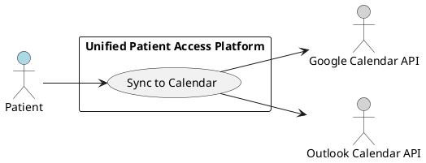

## Risks and Mitigations

| Risk                                                                         | Impact                                                        | Likelihood | Mitigation                                                                                                                                                                                 |
| ---------------------------------------------------------------------------- | ------------------------------------------------------------- | ---------- | ------------------------------------------------------------------------------------------------------------------------------------------------------------------------------------------ |
| HIPAA compliance violation due to insufficient encryption or access controls | Critical - Legal penalties, patient harm, reputational damage | Medium     | Implement AES-256 encryption at rest, TLS 1.2+ in transit from day 1; conduct compliance review at each milestone; enforce RBAC with minimum necessary standard                            |
| AI extraction inaccuracy producing incorrect clinical data or codes          | High - Patient safety risk, incorrect medical coding          | Medium     | Require human verification for all AI outputs; implement confidence scoring with thresholds; log AI-Human agreement rates; restrict AI suggestions to staff-reviewed workflows             |
| Free-tier hosting limitations causing performance degradation or downtime    | High - 99.9% uptime target at risk, poor user experience      | High       | Use Upstash Redis for aggressive caching; optimize database queries; implement circuit breakers and graceful degradation; monitor free-tier usage limits proactively                       |
| Complex or scanned PDF parsing failures producing incomplete clinical data   | Medium - Incomplete 360-Degree Patient View                   | Medium     | Support OCR for scanned documents; implement confidence scoring per extracted data point; provide manual data entry fallback; notify patients of processing failures with re-upload option |
| Calendar API free-tier rate limits blocking appointment synchronization      | Low - User convenience impact, not core functionality         | Medium     | Implement async queue for calendar sync operations; retry with exponential backoff; cache calendar state; allow manual sync trigger                                                        |

## Constraints and Assumptions

| ID  | Type       | Description                                                                                                                                                               | Rationale                                                              |
| --- | ---------- | ------------------------------------------------------------------------------------------------------------------------------------------------------------------------- | ---------------------------------------------------------------------- |
| C-1 | Constraint | All hosting and infrastructure must use free, open-source-friendly platforms; no paid cloud services (AWS, Azure) in Phase 1                                              | BRD Section 5 explicitly scopes out paid cloud hosting                 |
| C-2 | Constraint | No provider-facing features, provider logins, or provider-facing actions in Phase 1                                                                                       | BRD Section 6 Out-of-Scope designation                                 |
| C-3 | Constraint | Insurance pre-check is soft validation against an internal set of dummy records only, not live insurance verification                                                     | BRD Section 6 scopes insurance check as internal dummy data validation |
| A-1 | Assumption | AI/NLP processing for clinical document extraction and medical coding will use free, open-source models and tools compatible with the free-tier infrastructure constraint | No paid AI services are permitted per BRD infrastructure constraints   |
| A-2 | Assumption | Patients will upload clinical documents in PDF format; other document formats (DOCX, images) are not required in Phase 1                                                  | BRD specifies PDF as the clinical document format for extraction       |
